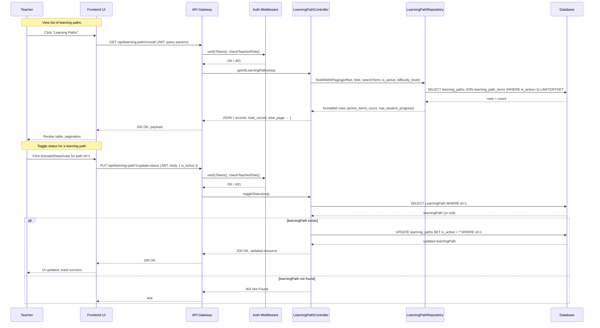
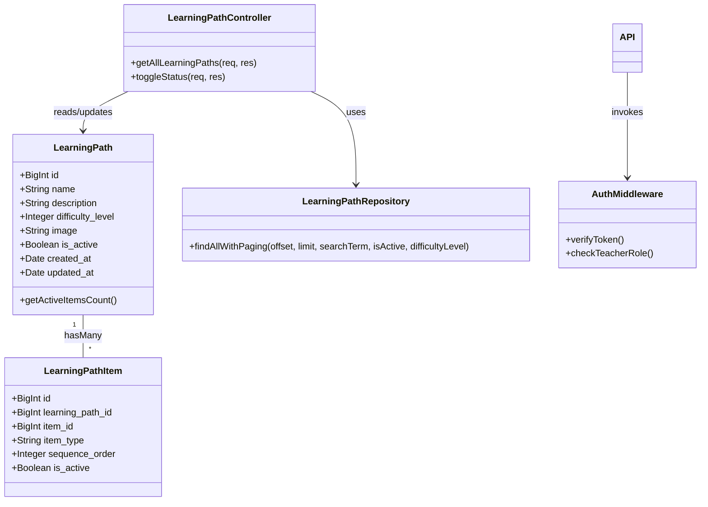

# UC_LP01: View List of Learning Paths

## Table of Contents

- [Use Case Details](#use-case-details)
- [Normal Sequence/Flow](#normal-sequenceflow)
- [Mockup Design](#mockup-design)
- [UI Elements Description](#ui-elements-description)
- [Error Messages & Validation Messages](#error-messages--validation-messages)
- [Business Rules](#business-rules)
- [Technical Implementation Notes](#technical-implementation-notes)
- [Diagram Components Overview](#diagram-components-overview)
- [Notes](#ghi-ch%c3%ba)

## Use Case Details

### Primary Actors
Teacher

### Secondary Actors
None

### Trigger
The Teacher clicks on the "Learning Paths" option in the management section.

### Description
As an Teacher, I want to view a list of available learning paths, so that I can efficiently browse, search, filter, and manage learning paths in the system.

### Preconditions
- The user must use an Teacher account to log into the system.
- The system must have learning paths data available.

### Postconditions
- The Teacher can perform search, filter, and sort operations on the learning paths list.
- The Teacher can open the "Create new" dialog to create a new learning path or open the "Edit" dialog to edit the selected learning path.
- The Teacher can edit items in each learning path.

### Normal Sequence/Flow

1. **The Teacher clicks the Learning Paths management section.**
2. **The system shows a table of learning paths with the following information in each column:**
  - Image (thumbnail)
  - Name
  - Difficulty Level (1-5 stars)
  - Active Status (Active / Inactive)
  - Items Count (number of active items in the path)
  - Action column (Edit information button, Edit items button)

3. **The Teacher can search for learning paths by name.**
4. **The system updates the table to display only learning paths matching the search term.**

5. **The Teacher can filter learning paths by:**
   - Difficulty Level (dropdown: 1-5)
   - Status (dropdown: Active/Inactive)

6. **The system updates the table to display only learning paths matching the selected filters.**

7. **The Teacher can sort the table by:**
   - Name (A-Z, Z-A)
   - Difficulty Level (Low to High, High to Low)
   - Active Status
   - Items Count 

8. **The system immediately refreshes the table with the selected sort order.**

9. **The Teacher can navigate through the list using pagination controls at the bottom.**
10. **The system immediately refreshes the table to show learning paths in the selected page.**

11. **The Teacher can change the number of learning paths displayed per page (5, 10, 20, 50).**
12. **The system displays the number of learning paths per page matching the selected number.**

### Alternative Sequence/Flow
None

### Exception Sequence/Flow

**Steps 3-12: Error while fetching learning paths:**
- If connection error occurs, the system displays a toast error message (MSG_14, MSG_15).

---

## Mockup Design

```
┌─────────────────────────────────────────────────────────────────────────────────────┐
│                           Learning Paths Management                                  │
├─────────────────────────────────────────────────────────────────────────────────────┤
│                                                                                     │
│ Filters: [Difficulty ▼] [Status ▼]                 [🔍 Search]   │[+ Create New]    |
│                                                                                     │
├─────────────────────────────────────────────────────────────────────────────────────┤
│ Image    │ Name                 │ Difficulty │ Status       │ Items Count │ Action     │
├─────────────────────────────────────────────────────────────────────────────────────┤
│ [📖]     │ Basic English Path   │ ★★        │ Active        │  12   │ [Edit info][Edit items] │
│ [📚]     │ Advanced Math        │ ★★★★★     │ Active      │   8   │ [Edit info][Edit items] │
│ [🎨]     │ Creative Art         │ ★★★       │ Inactive     │   0   │ [Edit info][Edit items] │
│ [🔬]     │ Science Explorer     │ ★★★★      │ Active       │  15   │ [Edit info][Edit items] │
│ [🎵]     │ Music Foundation     │ ★★        │ Inactive      │   3   │ [Edit info][Edit items] │
├─────────────────────────────────────────────────────────────────────────────────────┤
│                        Showing 1-5 of 23 records                                   │
│                    [◀️ Previous] [1][2][3][4][5] [Next ▶️]                         │
│                         Records per page: [10 ▼]                                   │
└─────────────────────────────────────────────────────────────────────────────────────┘
```

### UI Elements Description:
- **Search Bar:** Text input for searching by learning path name
- **Filter Dropdowns:** 
  - Difficulty: 1 , 2, 3, 4, 5
  - Status: Active, Inactive (filter only — separate from the per-row toggle)
- **Status (Active / Inactive):** Each row shows the current status as text `Active` or `Inactive`.
  - Note: The management list displays all learning paths to teachers regardless of their `is_active` value; Inactive paths remain visible in the teacher's table.
  - To change status, the teacher opens the edit dialog or uses bulk actions. Changing status hides/unhides the path for students based on `is_active`.
  - Status changes should call the API endpoint (see Technical Implementation Notes). Confirm when deactivating a path that contains active items.
- **Sort Controls:** Click column headers to sort (Name, Difficulty, Active, Items Count)
- **Pagination:** Previous/Next buttons + page numbers + records per page selector
- **Action Buttons (per row):**
  - `Edit information` — opens the edit dialog for learning path metadata (name, image, difficulty, description, etc.)
  - `Edit items` — opens the learning path items management (the UC_LP04 screen)
  - Note: Activation can be performed via the Edit dialog or via bulk Activate/Deactivate actions in the table toolbar.

---

## Error Messages & Validation Messages

### Messages

- **MSG_14:** "Connection error. Please try again later"
- **MSG_15:** "Server error occurred while processing request"

### When These Messages Occur:

**MSG_14** - Hiển thị khi:
- Connection timeout hoặc network error khi fetch data

**MSG_15** - Hiển thị khi:  
- Server internal error (500) khi xử lý request

---

### Business Rules


### Business Rules Applied to UC_LP01

| ID | Business Rule | Description |
|----|---------------|-------------|
| **BR_1** | The list displays 10 records per page by default | The number record can be changed via the "Display" dropdown below the table. |
| **BR_2** | The user must have permission or be authorized to access certain functionalities | Ensure the security for the system, only allow users to have the right permission to implement the function. |
---

### Technical Implementation Notes

### Required API Endpoint for View Screen
- `GET /api/learning-path/cms/all` - Dùng duy nhất cho màn hình xem danh sách learning path (bao gồm search, filter, sort, pagination)

- `PUT /api/learning-path/1/update-status` - Replace `is_active` for a learning path. Request body: `{ "is_active": true|false }`. Used by status change actions in Edit dialog or bulk actions. Return 200 and the updated resource on success.

### Database Query Requirements
- Truy vấn duy nhất với Sequelize `findAndCountAll()`
- Bao gồm liên kết model: LearningPathItems (chỉ đếm item active)
- Hỗ trợ WHERE động theo filter/search
- LIMIT/OFFSET cho phân trang

### Security Considerations
- Yêu cầu xác thực JWT cho endpoint này
- Chỉ teacher mới truy cập được
- Validate/sanitize input search/filter
- Chống SQL injection qua query tham số hóa

---

## Diagram Components Overview

### Sequence Diagram (Mermaid)


### Class Diagram (Mermaid)


These Mermaid diagrams target mermaidchart.com/play — copy and paste the fenced code blocks into the editor there to render.