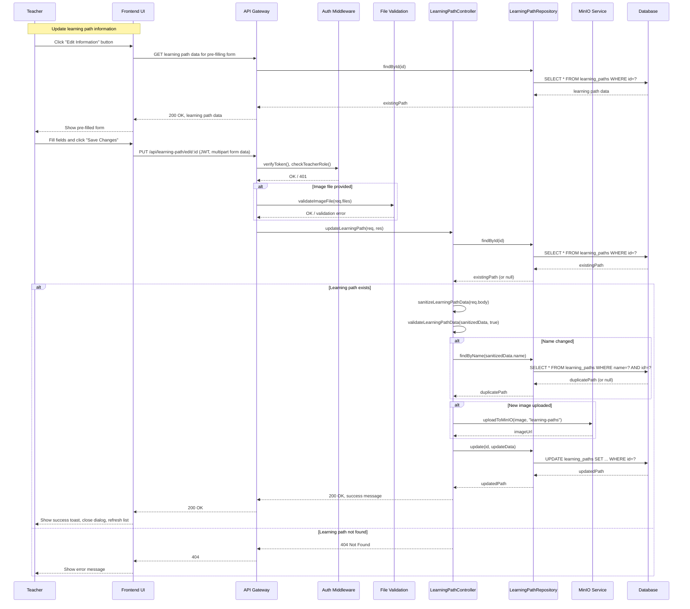
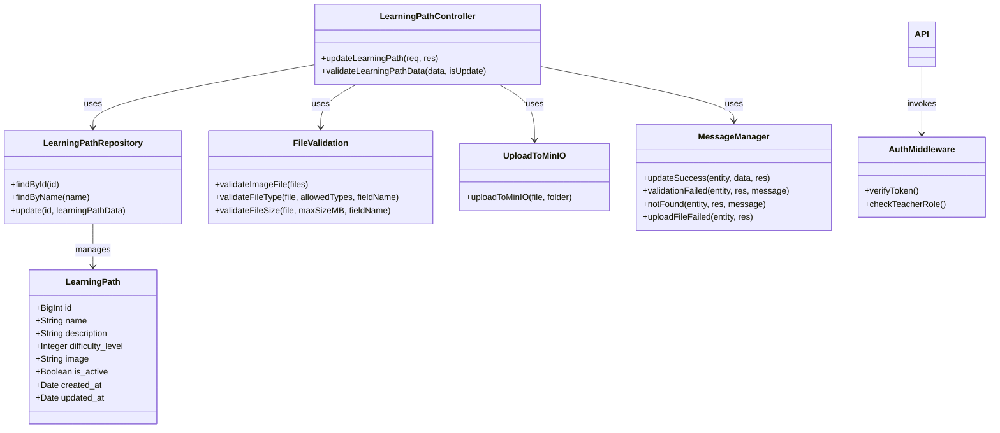

# UC_LP03: Update Learning Path

## Table of Contents

- [Use Case Details](#use-case-details)
- [Normal Sequence/Flow](#normal-sequenceflow)
- [Mockup Design](#mockup-design)
- [UI Elements Description](#ui-elements-description)
- [Error Messages & Validation Messages](#error-messages--validation-messages)
- [Business Rules](#business-rules)
- [Technical Implementation Notes](#technical-implementation-notes)
- [Diagram Components Overview](#diagram-components-overview)
# UC_LP03: Update Learning Path

## Use Case Details

### Primary Actors
Teacher

### Secondary Actors
None

### Trigger
The Teacher clicks on the "Edit Information" button in the column Action of Learning Paths Management screen for a specific learning path.

### Description
As an Teacher, I want to update an existing learning path's information (name, description, difficulty, image, status), so that I can maintain and improve the learning content while ensuring student progress is preserved.

### Preconditions
- The teacher must be authenticated with a valid JWT token
- The teacher must have Teacher role permissions (verified by Auth & Role middleware)
- The learning path must exist in the system
- The teacher must be on the Learning Paths Management screen

### Postconditions
- The learning path record is updated in the database with new information
- Success message (MSG_1) is displayed to the Teacher
- The form/dialog is closed.
- The updated learning path appears with new information in the list

## Normal Sequence/Flow

1. **The Teacher clicks the "Edit Information" for a specific learning path in the Learning Paths Management table.**

2. **The system retrieves the current learning path data and opens an Update Learning Path dialog/form pre-filled with existing values:**
   - Name
   - Description
   - Difficulty Level
   - Image Upload
   - Active Status

3. **The Teacher fills the fields and clicks on Save button.**

4. **The system validates the form, if the error is found, it shows the respective error message:**
   - If Name is empty, show (MSG_5)
   - If Name exceeds 255 characters, show (MSG_7)
   - If Difficulty Level is not selected, show (MSG_9)
   - If Image file size > 5MB, show (MSG_12)
   - If Image format is invalid, show (MSG_13)
   - If Description exceeds 1000 characters, show (MSG_8)
   - If Name already exists in database (except current record), show (MSG_6)

5. **If validation passes, the system attempts to save the updated record to the database.**
   - If action save is successful, show (MSG_1) and close the dialog
   - If action error occurs, show (MSG_15)

## Alternative Sequence/Flow

**Alternative 1 - Cancel Operation:**
- At any step: Teacher clicks "Cancel" button
- System discards all input changes
- System returns to Learning Paths Management screen with original data
- No success or error message displayed

## Exception Sequence/Flow

**Step 5: System-level Errors:**
- If network connection fails during form submit: Display (MSG_14)
- If learning path not found during update: Display (MSG_17)

## Mockup Design

### MOCKUP DESIGN

```
┌─────────────────────────────────────────────────────────────────────────────────────┐
│                            Update Learning Path                                     │
├─────────────────────────────────────────────────────────────────────────────────────┤
│                                                                                     │
│  Name: *                                                                            │
│  ┌─────────────────────────────────────────────────────────────────────────────┐   │
│  │ Basic English Reading Path                                                  │   │
│  └─────────────────────────────────────────────────────────────────────────────┘   │
│                                                                                     │
│  Description:                                                                       │
│  ┌─────────────────────────────────────────────────────────────────────────────┐   │
│  │ Lộ trình học đọc tiếng Anh cơ bản dành cho trẻ em từ 6-8 tuổi              │   │
│  │                                                                             │   │
│  │                                                                             │   │
│  └─────────────────────────────────────────────────────────────────────────────┘   │
│                                                                                     │
│  Difficulty Level: *                                                                │
│  ┌─────────────────────────────────────┐                                           │
│  │ Level 2 ▼                           │                                           │
│  └─────────────────────────────────────┘                                           │
│   Level 1                                                          │
│   Level 2                                                          │
│   Level 3                                                          │
│   Level 4                                                          │
│   Level 5                                                          │
│                                                                                     │
│  Image: (Optional)                                                                  │
│  ┌─────────────────────────────────────────────────────────────────────────────┐   │
│  │                          📁 Choose File                                     │   │
│  │                                                                          │   │
│  │                                                                           │   │
│  │                                                                               │   │
│  └─────────────────────────────────────────────────────────────────────────────┘   │
│                                                                                     │
│  ┌─────────────────────────────────────────────────────────────────────────────┐   │
│  │ 📷 [basic_english_path.jpg] (1.2 MB) ✅ Current Image                      │   │
│  └─────────────────────────────────────────────────────────────────────────────┘   │
│                                                                                     │
│  Status: *                                                                          │
│  ┌─────────────────────────────────────┐                                           │
│  │ ✅ Active ▼                         │                                           │
│  └─────────────────────────────────────┘                                           │
│                                                                                     │
│  ⚠️ Note: Deactivating will hide this path from students                           │
│                                                                                     │
├─────────────────────────────────────────────────────────────────────────────────────┤
│                                                                                     │
│                    [Cancel]                              [Save Changes]             │
│                                                                                     │
└─────────────────────────────────────────────────────────────────────────────────────┘
```

### UI Elements Description:
- **Name Field:** Required text input with validation, max 255 characters, pre-filled with current value
- **Description Field:** Optional textarea, max 1000 characters with character counter, pre-filled with current value
- **Difficulty Dropdown:** Required selection with Level 1-5 options, current difficulty pre-selected
- **Image Upload Area:** Optional drag & drop file upload with preview, validation indicators
- **Current Image Display:** Shows existing image filename and size below upload area
- **Status Dropdown:** Required selection between Active/Inactive, current status pre-selected
- **Cancel Button:** Discards all changes and returns to learning paths list
- **Save Changes Button:** Updates learning path and returns to list

### Form Validation Behavior:
- **Submit validation:** Validate all fields when Save Changes button is clicked
- **Error messages:** Display specific error messages with toast notifications after Save is clicked
- **Student progress check:** Validate before allowing status change to inactive

## Error Messages & Validation Messages

### Messages

- **MSG_1:** "Learning path updated successfully"
- **MSG_5:** "Learning path name is required"
- **MSG_6:** "Learning path name must be unique"
- **MSG_7:** "Learning path name cannot exceed 255 characters"
- **MSG_8:** "Description cannot exceed 1000 characters"
- **MSG_9:** "Difficulty level is required"
- **MSG_10:** "Difficulty level must be between 1 and 5"
- **MSG_12:** "Image file size cannot exceed 5MB"
- **MSG_13:** "Image must be JPG or JPEG or PNG or GIF or WebP file"
- **MSG_14:** "Connection error. Please try again later"
- **MSG_17:** "Learning path not found"

### When These Messages Occur

**MSG_1** - Hiển thị khi:
- Learning path được cập nhật thành công và commit vào database
- Tất cả validation đều pass
- Image được upload thành công lên MinIO (nếu có)

**MSG_5** - Hiển thị khi:
- User xóa hết nội dung trường Name và click Save

**MSG_6** - Hiển thị khi:
- Tên learning path đã tồn tại trong database ở record khác (case-insensitive check)
- Server validation trước khi update database

**MSG_7** - Hiển thị khi:
- User nhập tên vượt quá 255 ký tự

**MSG_8** - Hiển thị khi:
- User nhập description vượt quá 1000 ký tự
- Real-time validation với character counter

**MSG_9** - Hiển thị khi:
- User không chọn difficulty level và click Save
- Required field validation

**MSG_10** - Hiển thị khi:
- Server receive invalid difficulty value (not 1-5)
- Client-side manipulation protection

**MSG_12** - Hiển thị khi:
- File size vượt quá 5MB limit khi upload image mới
- Client-side validation ngay khi select file

**MSG_13** - Hiển thị khi:
- File format không phải JPEG, PNG, GIF, WebP khi upload image mới
- MIME type validation

**MSG_14** - Hiển thị khi:
- Network connection error khi submit form

**MSG_15** - Hiển thị khi:
- Unexpected server errors

**MSG_16** - Hiển thị khi:
- Teacher cố gắng deactive learning path đã có student progress
- Business rule validation để protect student data

**MSG_17** - Hiển thị khi:
- Learning path ID không tồn tại trong database
- Record đã bị xóa hoặc corrupted

## Business Rules Applied to UC_LP03

| ID | Business Rule | Description | Implementation |
|----|---------------|-------------|----------------|
| **BR_1** | Transaction required for UPDATE operations | All UPDATE operations must use database transaction | Sequelize transaction wrapper around update operation |
| **BR_2** | Teacher authorization required | Only authenticated teacher users can update learning paths | Auth.middleware.js + Role.middleware.js |
| **BR_3** | Fail-fast validation principle | Stop on first validation error and return immediately | Controller validation before database operations |
| **BR_4** | File upload size restrictions | Images max 5MB, stored in MinIO with validation | FileValidation.helper.js + UploadToMinIO.helper.js |
| **BR_5** | Soft delete policy | Cannot deactivate learning paths with student progress | Check StudentReading records before status change |
| **BR_6** | Unique name constraint | Learning path names must be unique except current record | Database unique constraint + validation check excluding current ID |
| **BR_7** | Difficulty standardization | Difficulty level must be between 1-5 | Input validation + database constraint |
| **BR_8** | Student progress protection | Preserve student data when updating learning paths | Validate student progress before deactivation |
| **BR_9** | Required field validation | Name and difficulty are mandatory fields | Form validation + server-side validation |
| **BR_10** | Character limit enforcement | Name max 255 chars, description max 1000 chars | Input validation + database column limits |
| **BR_11** | File format validation | Only JPEG, PNG, GIF, WebP images allowed | MIME type validation in FileValidation helper |
| **BR_12** | Response format consistency | Use MessageManager for all API responses | messageManager.success() / messageManager.validationFailed() |

## Technical Implementation Notes

### Required API Endpoints
- `PUT /api/learning-path/edit/:id` - Update existing learning path with optional image upload (multipart/form-data)

### API Request Contract
```javascript
PUT /api/learning-path/edit/:id
Content-Type: multipart/form-data
Authorization: Bearer <JWT_TOKEN>

Form Data:
- name (string, required) - Learning path name, max 255 characters
- description (string, optional) - Description, max 1000 characters  
- difficulty_level (integer, required) - Difficulty level 1-5
- is_active (integer, required) - Active status 1 or 0
- image (file, optional) - New image file max 5MB, formats: JPEG/PNG/GIF/WebP
```

### Database Operations Required
- Repository methods: `findById()`, `findByName()`, `update()`, `checkStudentProgress()`
- Single UPDATE query với transaction support
- Validate unique name excluding current record
- Check student progress before deactivation (BR_5)

### Security & Performance Considerations
- **File Upload Security**: Use FileValidation.helper.js to prevent malicious uploads
- **Input Sanitization**: Sanitize all string inputs to prevent XSS
- **Transaction Management**: Ensure data consistency with proper rollback on errors
- **MinIO Integration**: Handle MinIO service failures gracefully, keep existing image on upload failure
- **Unique Constraint**: Use database-level unique constraint + application validation excluding current record
- **Student Data Protection**: Always check student progress before allowing deactivation
- **File Size Optimization**: Consider image compression before storing in MinIO

## Diagram Components Overview

### Sequence Diagram (Mermaid)


### Class Diagram (Mermaid)


These Mermaid diagrams target mermaidchart.com/play — copy and paste the fenced code blocks into the editor there to render.

---

## Notes

Ghi chú: Use case này tập trung vào việc cập nhật thông tin cơ bản của learning path với bảo vệ dữ liệu học sinh. Quản lý items trong learning path được thực hiện ở các use case riêng biệt (UC_LP04, UC_LP05).
