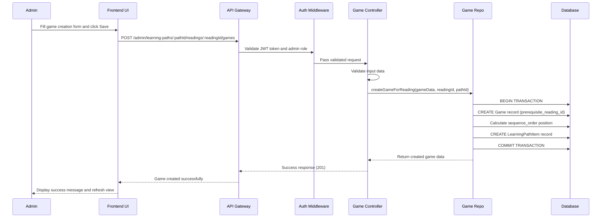
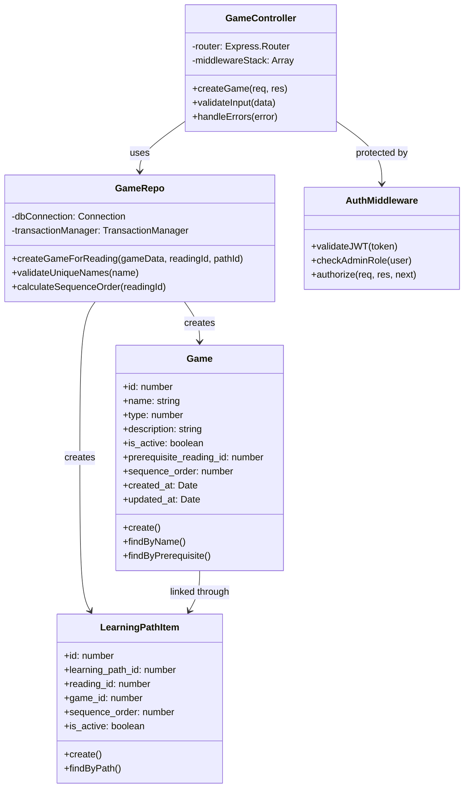

# UC_G01: Create Game

## Use Case Details

### 1. USE CASE DETAILS

**Primary Actors**
Admin

**Secondary Actors**
None

**Trigger**
The Admin clicks on the "Add Game" button next to a specific reading item while editing a learning path.

**Description**
As an Admin, I want to create a new game with name, type, and description for a specific reading in a learning path, so that I can add interactive activities that reinforce the reading content for students. Words will be added later through the game edit interface.

**Preconditions**
- The user must be authenticated with an Admin account and logged into the system
- The user must be in the Learning Path Edit mode for a specific learning path
- A reading item must exist in the learning path to serve as prerequisite for the new game
- The system must be connected to the database

**Postconditions**
- A new game record is created in the database with is_active = false by default
- A new LearningPathItem is created linking the game to the current learning path
- The game is positioned after the last game with the same prerequisite_reading_id
- The sequence_order is auto-calculated to maintain proper learning path ordering
- The user receives a success notification (MSG_1)
- The system returns to the Learning Path Edit screen with the new game displayed
- The game is ready for word assignment through the Edit Game interface

### 2. NORMAL SEQUENCE/FLOW

1. **The Admin is editing a learning path and clicks the "Add Game" button next to a specific reading item.**
2. **The system opens a Create Game dialog/modal with the following form fields:**
   - Game Name (text input, required, max 255 characters)
   - Game Type (dropdown, required) - options: Puzzle, Memory, Quiz, Matching
   - Description (textarea, optional, max 1000 characters)
3. **The Admin enters the game name and selects a game type from the dropdown.**
4. **The system validates the name input in real-time:**
   - Shows (MSG_5) if field is empty
   - Shows (MSG_7) if exceeds 255 characters
   - Checks name uniqueness and shows (MSG_8) if duplicate exists
5. **The Admin optionally enters a description for the game.**
6. **The system validates the description in real-time:**
   - Shows (MSG_9) if exceeds 1000 characters
7. **The Admin clicks the "Save" button to create the game.**
8. **The system validates all form data:**
    - Name: not empty, ≤255 chars, unique
    - Type: selected from valid options
    - Description: ≤1000 chars (if provided)
9. **The system starts a database transaction and performs the following operations:**
    - Creates new Game record with is_active = false and prerequisite_reading_id set to the selected reading
    - Calculates the optimal sequence_order position (after the last game with same prerequisite_reading_id)
    - Creates new LearningPathItem record linking the game to the current learning path
    - Commits the transaction if all operations succeed
10. **The system displays success message (MSG_1) and closes the dialog.**
11. **The system refreshes the Learning Path Edit screen to show the newly created game in the correct position.**

### 3. ALTERNATIVE SEQUENCE/FLOW

**Alternative 1 - Cancel Operation:**
- **Điều kiện kích hoạt:** At any step, Admin clicks "Cancel" button or closes dialog
- **Các bước thực hiện:** 
  - System discards all entered data without saving
  - System closes the Create Game dialog
- **Kết quả:** System returns to Learning Path Edit screen with no changes


### 4. EXCEPTION SEQUENCE/FLOW

**Steps 4, 6: Field Validation Errors:**
- **Name empty:** Display (MSG_5) "Game name cannot be empty"
- **Name too long:** Display (MSG_7) "Game name cannot exceed 255 characters"  
- **Name duplicate:** Display (MSG_8) "A game with this name already exists"
- **Description too long:** Display (MSG_9) "Description cannot exceed 1000 characters"
- **Type not selected:** Display (MSG_6) "Game type must be selected"

**Steps 8-9: Business Logic Errors:**
- **Database constraint violation:** Display (MSG_11) "Game creation failed due to data conflicts"

**Steps 9-10: System-level Errors:**
- **Network connection failure:** Display (MSG_14) "Connection error. Please try again"
- **Database transaction failure:** Display (MSG_15) "Server error occurred. Game was not created"
- **Transaction rollback:** Display (MSG_16) "Game creation failed and changes were undone"

## Mockup Design

### 5. MOCKUP DESIGN

```
┌─────────────────────────────────────────────────────────────────────────────────────┐
│                           Create New Game for Reading                               │
├─────────────────────────────────────────────────────────────────────────────────────┤
│                                                                                     │
│  📖 Prerequisite Reading: "The Little Cat"                                         │
│                                                                                     │
│  Game Name *                                                                        │
│  ┌─────────────────────────────────────────────────────────────────────────────┐   │
│  │ Enter game name...                                                          │   │
│  └─────────────────────────────────────────────────────────────────────────────┘   │
│                                                                                     │
│  Game Type *                                                                        │
│  ┌─────────────────────────────────────────────────────────────────────────────┐   │
│  │ Select game type ▼                                                          │   │
│  └─────────────────────────────────────────────────────────────────────────────┘   │
│                                                                                     │
│  Description                                                                        │
│  ┌─────────────────────────────────────────────────────────────────────────────┐   │
│  │ Enter game description (optional)...                                        │   │
│  │                                                                             │   │
│  │                                                                             │   │
│  └─────────────────────────────────────────────────────────────────────────────┘   │
│                                                                                     │
│  💡 Note: Words can be added after creating the game through Edit Game.            │
│                                                                                     │
├─────────────────────────────────────────────────────────────────────────────────────┤
│                             [Cancel]  [Save]                                        │
└─────────────────────────────────────────────────────────────────────────────────────┘
```

### 6. UI ELEMENTS DESCRIPTION

**Input Fields:**
- **Game Name Field:** Required text input with real-time validation, max 255 characters
- **Game Type Dropdown:** Required selection from predefined options (Puzzle, Memory, Quiz, Matching)
- **Description Field:** Optional textarea with character counter, max 1000 characters

**Buttons & Controls:**
- **Save Button:** Validates form and creates game with transaction handling
- **Cancel Button:** Closes dialog and discards all entered data

**Display Elements:**
- **Prerequisite Reading Display:** Shows which reading this game will be linked to
- **Validation Messages:** Real-time error messages below each field
- **Character Counters:** For name and description fields
- **Information Note:** Explains that words can be added later through Edit Game

## Error Messages & Validation Messages

### 7. ERROR MESSAGES & VALIDATION MESSAGES

#### Messages
- **MSG_1:** "Game created successfully"
- **MSG_5:** "Game name cannot be empty"
- **MSG_6:** "Game type must be selected"
- **MSG_7:** "Game name cannot exceed 255 characters"
- **MSG_8:** "A game with this name already exists"
- **MSG_9:** "Description cannot exceed 1000 characters"

- **MSG_11:** "Game creation failed due to data conflicts"
- **MSG_14:** "Connection error. Please try again"
- **MSG_15:** "Server error occurred. Game was not created"
- **MSG_16:** "Game creation failed and changes were undone"

#### When These Messages Occur

**MSG_1** - Hiển thị khi:
- Game creation transaction commits successfully
- After step 14 in Normal Sequence/Flow
- Appears as success toast notification

**MSG_5** - Hiển thị khi:
- User leaves name field empty during real-time validation (step 4)
- User attempts to save form with empty name field (step 12)

**MSG_6** - Hiển thị khi:
- User attempts to save without selecting a game type (step 12)

**MSG_7** - Hiển thị khi:
- User enters more than 255 characters in name field (step 4)

**MSG_8** - Hiển thị khi:
- User enters a name that already exists in database (step 4, 12)

**MSG_9** - Hiển thị khi:
- User enters more than 1000 characters in description field (step 6)

**MSG_14, MSG_15, MSG_16** - Hiển thị khi:
- System-level errors occur during transaction (step 13-14)

## Business Rules Applied to UC_G01

### 8. BUSINESS RULES APPLIED TO UC_G01

| ID | Business Rule | Description | Implementation |
|----|---------------|-------------|----------------|
| **BR_1** | Transaction required for CREATE operations | All CREATE operations must use database transaction | Sequelize transaction wrapper with rollback |
| **BR_2** | Admin authorization required | Only authenticated admin users can create games | JWT + Role middleware validation |
| **BR_3** | Input validation at controller | All input data must be validated at controller level | Express-validator middleware |
| **BR_4** | Unique game names | Game names must be unique across the system | Database unique constraint + validation |
| **BR_5** | Default inactive status | New games are created with is_active = false | Set in model default or creation logic |
| **BR_6** | Auto sequence ordering | Games get auto-incremented sequence_order | Database trigger or application logic |
| **BR_7** | Response format standardization | Use messageManager for consistent responses | MessageManager.success/error methods |
| **BR_8** | Fail-fast validation | Stop validation on first error found | Validation middleware with early return |

## Technical Implementation Notes

### 9. TECHNICAL IMPLEMENTATION NOTES

#### Required API Endpoint
- `POST /admin/learning-paths/:pathId/readings/:readingId/games` - Create new game for specific reading in learning path

#### API Request Contract
```javascript
POST /admin/learning-paths/:pathId/readings/:readingId/games
Content-Type: application/json
Authorization: Bearer <JWT_TOKEN>

// Path parameters
// :pathId - ID of the learning path being edited
// :readingId - ID of the reading that will be prerequisite for new game

// Request body format
{
  "name": "string (required, max 255 chars)",
  "type": "number (required, 1-4: Puzzle/Memory/Quiz/Matching)",
  "description": "string (optional, max 1000 chars)"
}
```

#### API Response Contract  
```javascript
// Success Response (201)
{
  "statusCode": 201,
  "message": "Game created successfully",
  "data": {
    "id": 123,
    "name": "Animal Matching Game",
    "type": 1,
    "description": "Match animals with their names",
    "is_active": false,
    "prerequisite_reading_id": 15,
    "sequence_order": 4,
    "created_at": "2025-09-17T10:30:00Z",
    "learning_path_item": {
      "id": 78,
      "learning_path_id": 5,
      "sequence_order": 4
    }
  }
}

// Error Response (400/422/500)
{
  "statusCode": 400,
  "message": "Validation failed: Game name cannot be empty", 
  "data": null
}
```

#### Database Operations Required
- **Transaction pattern:** Use Sequelize transaction for atomic operations
- **Models involved:** Game, LearningPathItem, LearningPath
- **Validation implementation:** Express-validator + custom business rule validation
- **Sequence calculation:** Auto-calculate position after last game with same prerequisite_reading_id
- **Learning path integration:** Create LearningPathItem record to link game to path

#### Security & Performance Considerations
- **Authentication:** JWT token validation with admin role check
- **Input validation:** Sanitize all inputs, validate data types and constraints
- **Database:** Use prepared statements, validate foreign key references
- **Transaction handling:** Proper rollback on any operation failure

## Diagram Components Overview

### 10. DIAGRAM COMPONENTS OVERVIEW

#### Sequence Diagram



#### Class Diagram



## Notes

### 11. NOTES

- **Dependencies:** This use case depends on:
  - A specific learning path being in edit mode
  - A reading item existing as prerequisite for the new game
- **Context integration:** 
  - Game creation happens within Learning Path Edit context, not standalone
  - prerequisite_reading_id is automatically set from the selected reading
  - Sequence positioning follows learning path ordering logic
- **Future enhancements:** 
  - Bulk game creation from templates for multiple readings
  - Game preview functionality before saving to learning path
  - Quick game templates with pre-configured settings
- **Known limitations:** 
  - Game types are limited to predefined options (extensible in future)
  - Games can only be created for existing readings in learning paths
  - Games are created without initial words (must be added separately)
- **Integration requirements:** 
  - Tight integration with Learning Path Management system
  - Must maintain sequence ordering consistency within learning path
  - Integration with Game Edit functionality for word assignment
- **Special considerations:** 
  - Games created through this flow are inactive by default and must be explicitly activated
  - Position calculation must account for existing games under same reading prerequisite
  - Word assignment happens through separate Edit Game workflow
