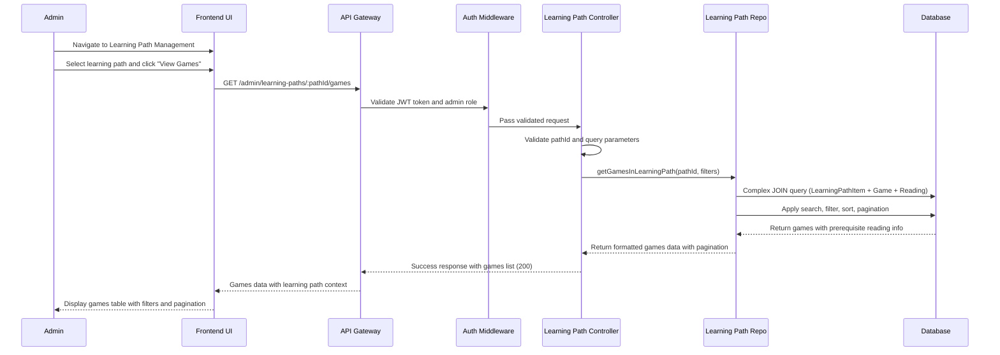
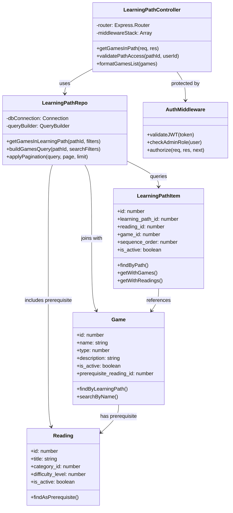

# UC_G02: View Games in Learning Path

## Use Case Details

### 1. USE CASE DETAILS

**Primary Actors**
Admin

**Secondary Actors**
None

**Trigger**
The Admin navigates to Learning Path Management, selects a specific learning path, and clicks "View Games" to see all games assigned to that learning path.

**Description**
As an Admin, I want to view all games assigned to a specific learning path with their details, sequence order, prerequisite readings, and status indicators, so that I can review and navigate to manage the interactive activities within the learning path effectively.

**Preconditions**
- The user must be authenticated with an Admin account and logged into the system
- The user must have access to the Learning Path Management section
- At least one learning path must exist in the system
- The selected learning path may contain games linked to readings

**Postconditions**
- A filtered list of games specific to the selected learning path is displayed
- Games are shown with their sequence order, prerequisite readings, and visual status indicators
- The Admin can navigate to edit individual games or remove them from the learning path
- Search, filter, and pagination states are maintained for the current learning path context
- Status information is displayed but cannot be changed from this view

### 2. NORMAL SEQUENCE/FLOW

1. **The Admin navigates to the Learning Path Management section.**
2. **The system displays a list of available learning paths with basic information.**
3. **The Admin selects a specific learning path from the list.**
4. **The Admin clicks the "View Games" button or tab for the selected learning path.**
5. **The system displays a games table specifically filtered for the selected learning path with columns:**
   - Sequence Order (position in learning path)
   - Game Name (with link to edit game)
   - Game Type (Puzzle, Memory, Quiz, Matching)
   - Prerequisite Reading (which reading this game follows)
   - Status (Active/Inactive)
   - Actions (Edit Game, Remove from Path)
6. **The Admin can search for games within this learning path using the search box:**
   - Search by game name
   - Search by prerequisite reading name
7. **The system updates the table to display only games matching the search criteria within the current learning path.**
8. **The Admin can filter games within the learning path by:**
   - Game Status (Active/Inactive) using dropdown
   - Game Type (Puzzle/Memory/Quiz/Matching) using dropdown
   - Prerequisite Reading using dropdown (readings within this path)
9. **The system applies the selected filters and updates the table accordingly.**
10. **The Admin can sort games by clicking column headers:**
    - Sort by Sequence Order (ascending/descending)
    - Sort by Game Name (ascending/descending)
    - Sort by Game Type (ascending/descending)
    - Sort by Status (ascending/descending)
    - Sort by Created Date (ascending/descending)
11. **The system applies the sort order and refreshes the table.**
12. **The Admin can navigate through pages if there are many games using pagination controls.**
13. **The system displays the paginated results while maintaining the learning path context.**
14. **The Admin can adjust the number of games displayed per page (10, 25, 50, 100).**
15. **The system updates the display according to the selected page size.**

### 3. ALTERNATIVE SEQUENCE/FLOW

**Alternative 1 - No Games in Learning Path:**
- **Điều kiện kích hoạt:** Selected learning path contains no games
- **Các bước thực hiện:**
  - System displays empty state message "No games found in this learning path"
  - System shows "Add Game" button to add games from existing readings
  - System provides link to "Manage Learning Path Items" for full editing
- **Kết quả:** Admin can navigate to add games or edit learning path structure

**Alternative 2 - Return to Learning Path List:**
- **Điều kiện kích hoạt:** Admin clicks "Back to Learning Paths" or breadcrumb navigation
- **Các bước thực hiện:**
  - System saves current filter/search states for potential return
  - System navigates back to Learning Path Management list
- **Kết quả:** Admin returns to learning path overview with context preserved

### 4. EXCEPTION SEQUENCE/FLOW

**Steps 7, 9, 11: Data Retrieval Errors:**
- **Network connection failure:** Display (MSG_21) "Connection error while loading games"
- **Database query timeout:** Display (MSG_22) "Loading took too long. Please try again"
- **Invalid learning path ID:** Display (MSG_23) "Learning path not found or access denied"

**Steps 12-15: Pagination Errors:**
- **Invalid page number:** Display (MSG_24) "Invalid page requested. Returning to first page"
- **Page size limit exceeded:** Display (MSG_25) "Maximum display limit exceeded. Using default size"

**Steps 6-8: Search/Filter Errors:**
- **Invalid search parameters:** Display (MSG_26) "Search parameters invalid. Please try again"
- **Filter combination returns no results:** Display informational message "No games match current filters"

## Mockup Design

### 5. MOCKUP DESIGN

```
┌─────────────────────────────────────────────────────────────────────────────────────┐
│ Learning Path: "Basic English Reading Path" > Games                                 │
├─────────────────────────────────────────────────────────────────────────────────────┤
│                                                                                     │
│  [← Back to Learning Paths]                                     [Manage Path Items] │
│                                                                                     │
│  🎮 Games in this Learning Path (8 games)                                          │
│                                                                                     │
│  Search: ┌─────────────────────────┐  Filter by:                                   │
│          │ Search games...         │  Type: [All Types ▼]  Status: [All ▼]       │
│          └─────────────────────────┘  Reading: [All Readings ▼]                   │
│                                                                                     │
│ ┌─────┬──────────────────┬─────────┬────────────────────┬─────────┬──────────────┐ │
│ │Seq#│ Game Name        │ Type    │ Prerequisite       │ Status  │ Actions      │ │
│ ├─────┼──────────────────┼─────────┼────────────────────┼─────────┼──────────────┤ │
│ │ 2   │Animal Match Game │ Matching│ The Little Cat     │ ● Active │[Edit][Remove]│ │
│ │ 4   │Cat Memory Game   │ Memory  │ The Little Cat     │ ○ Inactive│[Edit][Remove]│ │
│ │ 7   │Family Quiz       │ Quiz    │ My Family Story    │ ● Active │[Edit][Remove]│ │
│ │ 9   │Color Puzzle      │ Puzzle  │ Colors and Shapes  │ ● Active │[Edit][Remove]│ │
│ └─────┴──────────────────┴─────────┴────────────────────┴─────────┴──────────────┘ │
│                                                                                     │
│ Showing 1-4 of 8 games  [10 per page ▼]     [« 1 2 »]                            │
│                                                                                     │
└─────────────────────────────────────────────────────────────────────────────────────┘
```

### 6. UI ELEMENTS DESCRIPTION

**Navigation Elements:**
- **Learning Path Breadcrumb:** Shows current path context and allows navigation back
- **Back Button:** Returns to Learning Path Management list
- **Manage Path Items Button:** Navigate to full learning path editing interface

**Information Display:**
- **Path Title:** Shows the name of the current learning path being viewed
- **Game Counter:** Displays total number of games in the current learning path

**Search & Filter Controls:**
- **Search Box:** Text input for searching games by name or prerequisite reading
- **Type Filter:** Dropdown to filter by game type (All Types, Puzzle, Memory, Quiz, Matching)
- **Status Filter:** Dropdown to filter by active status (All, Active, Inactive)
- **Reading Filter:** Dropdown to filter by prerequisite reading (All Readings + specific readings in path)

**Data Table:**
- **Sequence Order Column:** Shows position of game in learning path sequence
- **Game Name Column:** Clickable game names that link to game editing
- **Type Column:** Visual indicators for game type with icons
- **Prerequisite Reading Column:** Shows which reading this game follows
- **Status Column:** Visual toggle indicators showing Active (●) or Inactive (○) status - display only, no interaction
- **Actions Column:** Edit and Remove buttons for each game

**Pagination Controls:**
- **Results Info:** Shows current page range and total count
- **Page Size Selector:** Dropdown to change items per page
- **Page Navigation:** Previous/Next buttons and page numbers

## Error Messages & Validation Messages

### 7. ERROR MESSAGES & VALIDATION MESSAGES

#### Messages
- **MSG_21:** "Connection error while loading games. Please check your internet connection."
- **MSG_22:** "Loading took too long. Please try again or contact support if the issue persists."
- **MSG_23:** "Learning path not found or you don't have permission to access it."
- **MSG_24:** "Invalid page requested. Returning to the first page."
- **MSG_25:** "Maximum display limit exceeded. Using default page size."
- **MSG_26:** "Search parameters are invalid. Please clear filters and try again."

#### When These Messages Occur

**MSG_21** - Hiển thị khi:
- Network connection fails during API calls (steps 7, 9, 11)
- Server is unreachable or returns connection timeout

**MSG_22** - Hiển thị khi:
- Database query takes longer than timeout threshold (steps 7, 9, 11)
- Large dataset processing exceeds time limits

**MSG_23** - Hiển thị khi:
- Invalid learning path ID is provided in URL (step 5)
- User doesn't have permission to view the learning path
- Learning path has been deleted or deactivated

**MSG_24** - Hiển thị khi:
- User attempts to navigate to invalid page number (step 12)
- Page number exceeds available pages for current filter

**MSG_25** - Hiển thị khi:
- User requests page size larger than system maximum (step 14)
- Invalid page size parameter provided

**MSG_26** - Hiển thị khi:
- Malformed search query parameters (steps 6-8)
- Invalid filter combinations that cause system errors

## Business Rules Applied to UC_G02

### 8. BUSINESS RULES APPLIED TO UC_G02

| ID | Business Rule | Description | Implementation |
|----|---------------|-------------|----------------|
| **BR_1** | Single query principle | All search, filter, sort, and pagination must use one database query | Sequelize findAndCountAll with complex WHERE clauses |
| **BR_2** | Learning path context filtering | Only show games belonging to selected learning path | JOIN with LearningPathItem table on game_id |
| **BR_3** | Admin authorization required | Only authenticated admin users can view learning path games | JWT + Role middleware validation |
| **BR_4** | Sequence order preservation | Games displayed must maintain learning path sequence order | ORDER BY LearningPathItem.sequence_order |
| **BR_5** | Prerequisite reading display | Show which reading each game follows | JOIN with Reading table through prerequisite_reading_id |
| **BR_6** | Status-based visual indicators | Inactive games shown with distinct visual indicators (read-only) | Frontend conditional CSS classes and icons |
| **BR_7** | Filter state preservation | Maintain filter/search state during pagination | URL query parameters and session storage |
| **BR_8** | Response format standardization | Use messageManager for consistent API responses | MessageManager.success/error methods |

## Technical Implementation Notes

### 9. TECHNICAL IMPLEMENTATION NOTES

#### Required API Endpoint
- `GET /admin/learning-paths/:pathId/games` - Retrieve games for specific learning path with filtering

#### API Request Contract
```javascript
GET /admin/learning-paths/:pathId/games?search=cat&type=1&status=active&reading_id=5&sort=sequence_order&order=asc&page=1&limit=10
Authorization: Bearer <JWT_TOKEN>

// Path parameters
// :pathId - ID of the learning path to view games for

// Query parameters (all optional)
// search - Text search in game name or prerequisite reading name
// type - Game type filter (1=Puzzle, 2=Memory, 3=Quiz, 4=Matching)
// status - Status filter ('active', 'inactive', 'all')
// reading_id - Filter by specific prerequisite reading ID
// sort - Sort field ('sequence_order', 'name', 'type', 'status', 'created_at')
// order - Sort direction ('asc', 'desc')
// page - Page number (default: 1)
// limit - Items per page (default: 10, max: 100)
```

#### API Response Contract
```javascript
// Success Response (200)
{
  "statusCode": 200,
  "message": "Games retrieved successfully",
  "data": {
    "learning_path": {
      "id": 5,
      "name": "Basic English Reading Path",
      "difficulty_level": 2
    },
    "games": [
      {
        "id": 123,
        "name": "Animal Matching Game",
        "type": 1,
        "description": "Match animals with their names",
        "is_active": true,
        "sequence_order": 2,
        "created_at": "2025-09-15T10:30:00Z",
        "prerequisite_reading": {
          "id": 15,
          "title": "The Little Cat",
          "sequence_order": 1
        },
        "learning_path_item": {
          "id": 78,
          "sequence_order": 2
        }
      }
    ],
    "pagination": {
      "current_page": 1,
      "total_pages": 2,
      "total_records": 8,
      "per_page": 10,
      "has_next": true,
      "has_previous": false
    }
  }
}

// Error Response (404/403/500)
{
  "statusCode": 404,
  "message": "Learning path not found or access denied",
  "data": null
}
```

#### Database Operations Required
- **Complex JOIN query:** LearningPathItem → Game → Reading for prerequisite info
- **Filtering logic:** Multiple WHERE conditions for search, type, status, reading filters
- **Sorting capability:** ORDER BY with multiple column options
- **Pagination:** LIMIT and OFFSET with COUNT for total records
- **Security:** Validate learning path access permissions

#### Security & Performance Considerations
- **Authorization:** Verify admin has access to specific learning path
- **Input validation:** Sanitize all query parameters, validate sort fields
- **Query optimization:** Use proper indexes on learning_path_id, sequence_order, is_active
- **Result limiting:** Maximum page size to prevent large data dumps

## Diagram Components Overview

### 10. DIAGRAM COMPONENTS OVERVIEW

#### Sequence Diagram



#### Class Diagram



## Notes

### 11. NOTES

- **Dependencies:** This use case depends on:
  - Learning Path Management system being accessible
  - Valid learning path existing with proper permissions
  - LearningPathItem relationships established between paths and games
- **Context awareness:** 
  - All operations are scoped to specific learning path context
  - Game listing is filtered by learning path membership, not global games
  - Sequence order reflects position within the learning path, not global order
- **Future enhancements:**
  - Drag-and-drop reordering of games within learning path
  - Bulk operations for managing multiple games
  - Visual preview of game flow within learning path structure
  - Export functionality for game lists and learning path structure
- **Known limitations:**
  - Games can only be viewed in context of specific learning path
  - No cross-learning-path game comparison functionality
  - Maximum 100 games per page for performance reasons
- **Integration requirements:**
  - Tight integration with Learning Path Item management
  - Dependency on Game Edit functionality for detailed game management
  - Integration with Reading management for prerequisite context
- **Special considerations:**
  - Sequence order is critical for learning path functionality
  - Prerequisite reading relationships must be maintained and displayed
  - Status is display-only in this view - status changes handled by separate UC
  - Filter state preservation improves admin workflow efficiency
