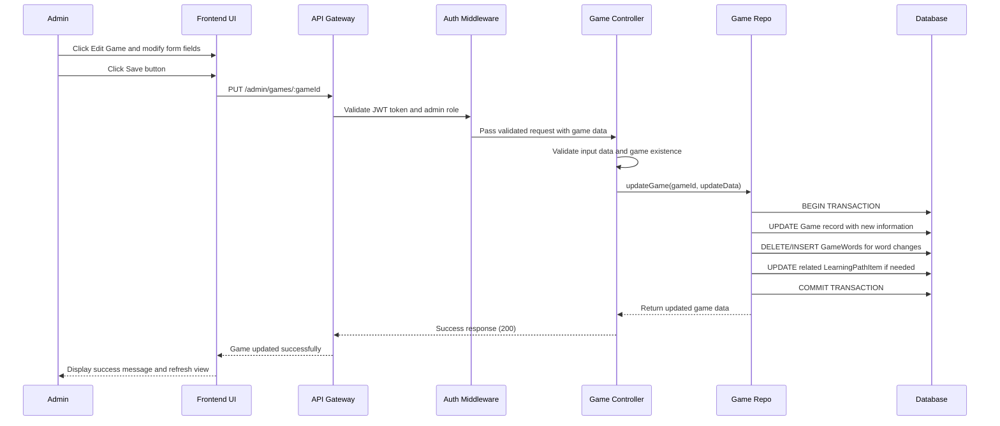
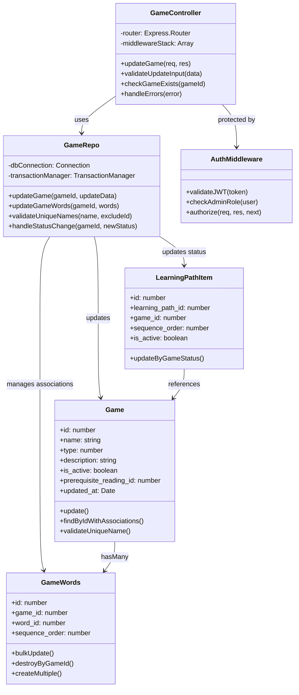

# UC_G03: Update Game

## Use Case Details

### 1. USE CASE DETAILS

**Primary Actors**
Admin

**Secondary Actors**
None

**Trigger**
The Admin clicks the "Edit Game" button from a game detail view or "Edit" action button from the learning path games list.

**Description**
As an Admin, I want to update the details of an existing game including name, type, description, and associated vocabulary words, so that I can correct information, improve game content, and maintain the quality of interactive learning activities.

**Preconditions**
- The user must be authenticated with an Admin account and logged into the system
- The user must have access to Learning Path Management or Game Management sections
- The game must exist in the system and be accessible to the admin
- The game may have existing word associations through GameWords relationships
- The system must be connected to the database

**Postconditions**
- The game record is updated in the database with new information
- GameWord relationships are updated if vocabulary words are modified
- Learning path associations remain intact unless explicitly modified
- The user receives a success notification (MSG_17)
- The system returns to the previous view (game detail or games list) with updated information displayed
- Data consistency is maintained across all related tables through transaction handling

### 2. NORMAL SEQUENCE/FLOW

1. **The Admin clicks "Edit Game" from a game detail view or games list.**
2. **The system validates game access permissions and loads the Edit Game form with current data:**
   - Game Name (pre-filled with current value)
   - Game Type (pre-selected with current value)
   - Description (pre-filled with current value)
   - Status toggle (Active/Inactive)
   - Associated Words section (showing current vocabulary words)
3. **The Admin modifies the desired fields (name, type, description, or status).**
4. **The Admin can also manage vocabulary words:**
   - Add new words using "Add Words" button
   - Remove existing words using delete buttons
   - Reorder words using drag-and-drop interface
5. **The Admin clicks "Save" button to update the game.**
6. **The system validates all form data and shows validation errors if any:**
   - Name: not empty, ≤255 chars, unique (if changed)
   - Type: selected from valid options
   - Description: ≤1000 chars (if provided)
   - Status: valid active/inactive value
7. **If validation fails, system displays appropriate error messages and stops the save process.**
8. **If validation passes, the system starts a database transaction and performs the following operations:**
   - Updates the Game record with new information
   - Updates GameWord relationships if vocabulary words were modified
   - Maintains sequence order for word associations
   - Updates learning path item status if game status changed
   - Commits the transaction if all operations succeed
9. **The system displays success message (MSG_17) and updates the interface.**
10. **The system returns to the previous view with refreshed data showing the updated game.**

### 3. ALTERNATIVE SEQUENCE/FLOW

**Alternative 1 - Cancel Operation:**
- **Điều kiện kích hoạt:** At any step, Admin clicks "Cancel" button or closes edit form
- **Các bước thực hiện:**
  - System discards all changes without saving
  - System returns to previous view (game detail or games list)
- **Kết quả:** No changes are made to the game data

**Alternative 2 - Add New Words:**
- **Điều kiện kích hoạt:** Admin clicks "Add Words" button during editing
- **Các bước thực hiện:**
  - System opens word selection modal with available vocabulary
  - Admin selects words and sets their sequence order
  - System adds selected words to the game's word collection
- **Kết quả:** New vocabulary words are associated with the game

**Alternative 3 - Status Change Impact:**
- **Điều kiện kích hoạt:** Admin changes game status from Active to Inactive
- **Các bước thực hiện:**
  - System checks if game is used in active learning paths
  - System shows warning about impact on student progress
  - Admin confirms or cancels the status change
- **Kết quả:** Status change proceeds with proper impact awareness

### 4. EXCEPTION SEQUENCE/FLOW

**Steps 6-7: Validation Errors (After Save Click):**
- **Name empty:** Display (MSG_29) "Game name cannot be empty"
- **Name too long:** Display (MSG_30) "Game name cannot exceed 255 characters"
- **Name duplicate:** Display (MSG_31) "A game with this name already exists"
- **Description too long:** Display (MSG_32) "Description cannot exceed 1000 characters"
- **Type not selected:** Display (MSG_52) "Game type must be selected"
- **Game not found:** Display (MSG_27) "Game not found or may have been deleted"

**Steps 8-9: Business Logic Errors:**
- **Database constraint violation:** Display (MSG_33) "Game update failed due to data conflicts"
- **Word assignment conflicts:** Display (MSG_34) "Unable to update vocabulary word associations"

**Steps 8-10: System-level Errors:**
- **Network connection failure:** Display (MSG_21) "Connection error. Please try again"
- **Database transaction failure:** Display (MSG_18) "Server error occurred. Game was not updated"
- **Transaction rollback:** Display (MSG_35) "Game update failed and changes were undone"

## Mockup Design

### 5. MOCKUP DESIGN

```
┌─────────────────────────────────────────────────────────────────────────────────────┐
│                               Edit Game: "Animal Matching Game"                     │
├─────────────────────────────────────────────────────────────────────────────────────┤
│                                                                                     │
│  [← Back to Games]                                               [Cancel] [Save]    │
│                                                                                     │
│  🎮 Game Information                                                                │
│  ┌─────────────────────────────────────────────────────────────────────────────┐   │
│  │ Game Name *                                                                 │   │
│  │ ┌─────────────────────────────────────────────────────────────────────┐   │   │
│  │ │ Animal Matching Game                                                │   │   │
│  │ └─────────────────────────────────────────────────────────────────────┘   │   │
│  │                                                                             │   │
│  │ Game Type *                                                                 │   │
│  │ ┌─────────────────────────────────────────────────────────────────────┐   │   │
│  │ │ Matching ▼                                                          │   │   │
│  │ └─────────────────────────────────────────────────────────────────────┘   │   │
│  │                                                                             │   │
│  │ Description                                                                 │   │
│  │ ┌─────────────────────────────────────────────────────────────────────┐   │   │
│  │ │ Match animals with their names and sounds                           │   │   │
│  │ │                                                                     │   │   │
│  │ └─────────────────────────────────────────────────────────────────────┘   │   │
│  │                                                                             │   │
│  │ Status: ● Active  ○ Inactive                                               │   │
│  └─────────────────────────────────────────────────────────────────────────────┘   │
│                                                                                     │
│  📝 Associated Words (4 words)                              [Add Words]             │
│  ┌─────────────────────────────────────────────────────────────────────────────┐   │
│  │ #1 🐱 cat        Level: 1  [↑] [↓] [✕]                                     │   │
│  │ #2 🐶 dog        Level: 1  [↑] [↓] [✕]                                     │   │
│  │ #3 🐦 bird       Level: 2  [↑] [↓] [✕]                                     │   │
│  │ #4 🐠 fish       Level: 1  [↑] [↓] [✕]                                     │   │
│  └─────────────────────────────────────────────────────────────────────────────┘   │
│                                                                                     │
│  📊 Learning Path Context                                                           │
│  ┌─────────────────────────────────────────────────────────────────────────────┐   │
│  │ Used in: Basic English Reading Path (Sequence: #2)                         │   │
│  │ Prerequisite: "The Little Cat"                                             │   │
│  └─────────────────────────────────────────────────────────────────────────────┘   │
│                                                                                     │
└─────────────────────────────────────────────────────────────────────────────────────┘
```

### 6. UI ELEMENTS DESCRIPTION

**Navigation Elements:**
- **Back Button:** Returns to previous view (game detail or games list)
- **Cancel Button:** Closes edit form without saving changes
- **Save Button:** Validates and updates game with transaction handling

**Form Fields:**
- **Game Name Field:** Required text input, max 255 characters (validation on save)
- **Game Type Dropdown:** Required selection from predefined options
- **Description Field:** Optional textarea with character counter, max 1000 characters
- **Status Toggle:** Radio buttons for Active/Inactive status selection

**Word Management Section:**
- **Associated Words List:** Shows current vocabulary words with sequence numbers
- **Add Words Button:** Opens word selection modal for adding new vocabulary
- **Word Controls:** Up/Down arrows for reordering, delete button for removal
- **Drag-and-Drop:** Alternative method for reordering word sequence

**Context Information:**
- **Learning Path Context:** Shows where this game is used and its position
- **Prerequisite Reading:** Displays which reading this game follows

**Validation Display:**
- **Error Messages:** Displayed after save attempt if validation fails
- **Success Messages:** Confirmation of successful update

## Error Messages & Validation Messages

### 7. ERROR MESSAGES & VALIDATION MESSAGES

#### Messages
- **MSG_17:** "Game updated successfully"
- **MSG_18:** "Server error occurred. Game was not updated"
- **MSG_21:** "Connection error. Please try again"
- **MSG_27:** "Game not found or may have been deleted"
- **MSG_29:** "Game name cannot be empty"
- **MSG_30:** "Game name cannot exceed 255 characters"
- **MSG_31:** "A game with this name already exists"
- **MSG_32:** "Description cannot exceed 1000 characters"
- **MSG_33:** "Game update failed due to data conflicts"
- **MSG_34:** "Unable to update vocabulary word associations"
- **MSG_35:** "Game update failed and changes were undone"
- **MSG_52:** "Game type must be selected"

#### When These Messages Occur

**MSG_17** - Hiển thị khi:
- Game update transaction commits successfully
- After step 9 in Normal Sequence/Flow
- Appears as success toast notification

**MSG_18, MSG_21, MSG_35** - Hiển thị khi:
- System-level errors occur during transaction (steps 8-10)
- Database connection issues or transaction failures

**MSG_27** - Hiển thị khi:
- Game ID doesn't exist when form is loaded (step 2)
- Game has been deleted by another user during editing

**MSG_29, MSG_30, MSG_31, MSG_32, MSG_52** - Hiển thị khi:
- User attempts to save with validation errors (steps 6-7)
- Form validation fails after Save button click

**MSG_33, MSG_34** - Hiển thị khi:
- Business logic validation fails during update process (steps 8-9)
- Data integrity constraints are violated

## Business Rules Applied to UC_G03

### 8. BUSINESS RULES APPLIED TO UC_G03

| ID | Business Rule | Description | Implementation |
|----|---------------|-------------|----------------|
| **BR_1** | Transaction required for UPDATE operations | All UPDATE operations must use database transaction | Sequelize transaction wrapper with rollback |
| **BR_2** | Admin authorization required | Only authenticated admin users can update games | JWT + Role middleware validation |
| **BR_3** | Input validation at controller | All input data must be validated at controller level | Express-validator middleware |
| **BR_4** | Unique game names | Game names must be unique across the system (if changed) | Database unique constraint + validation |
| **BR_5** | Data integrity maintenance | GameWord relationships updated atomically with game | Transaction includes all related table updates |
| **BR_6** | Learning path impact awareness | Status changes affect student learning progress | Validation and warning for status changes |
| **BR_7** | Response format standardization | Use messageManager for consistent responses | MessageManager.success/error methods |
| **BR_8** | Fail-fast validation | Stop validation on first error found | Validation middleware with early return |

## Technical Implementation Notes

### 9. TECHNICAL IMPLEMENTATION NOTES

#### Required API Endpoint
- `PUT /admin/games/:gameId` - Update existing game with comprehensive data

#### API Request Contract
```javascript
PUT /admin/games/:gameId
Content-Type: application/json
Authorization: Bearer <JWT_TOKEN>

// Path parameters
// :gameId - ID of the game to update

// Request body format
{
  "name": "string (required, max 255 chars)",
  "type": "number (required, 1-4: Puzzle/Memory/Quiz/Matching)",
  "description": "string (optional, max 1000 chars)",
  "is_active": "boolean (required)",
  "words": [
    {
      "word_id": "number (required)",
      "sequence_order": "number (required, 1-based)"
    }
  ]
}
```

#### API Response Contract
```javascript
// Success Response (200)
{
  "statusCode": 200,
  "message": "Game updated successfully",
  "data": {
    "id": 123,
    "name": "Updated Animal Matching Game",
    "type": 1,
    "description": "Updated description for matching game",
    "is_active": true,
    "prerequisite_reading_id": 15,
    "updated_at": "2025-09-18T10:30:00Z",
    "words": [
      {
        "id": 45,
        "word": "cat",
        "sequence_order": 1
      }
    ],
    "learning_paths": [
      {
        "id": 5,
        "name": "Basic English Reading Path",
        "sequence_order": 2
      }
    ]
  }
}

// Error Response (400/404/422/500)
{
  "statusCode": 400,
  "message": "Validation failed: Game name cannot be empty",
  "data": null
}
```

#### Database Operations Required
- **Transaction pattern:** Use Sequelize transaction for atomic operations
- **Models involved:** Game, GameWords, Words, LearningPathItem
- **Validation implementation:** Express-validator + custom business rule validation
- **Update operations:** Game record update + GameWords bulk update/delete/create
- **Integrity checks:** Validate game exists and user has update permissions

#### Security & Performance Considerations
- **Authentication:** JWT token validation with admin role check
- **Authorization:** Verify admin has permission to update specific game
- **Input validation:** Sanitize all inputs, validate data types and constraints
- **Transaction handling:** Proper rollback on any operation failure
- **Concurrent updates:** Handle potential race conditions with optimistic locking

## Diagram Components Overview

### 10. DIAGRAM COMPONENTS OVERVIEW

#### Sequence Diagram



#### Class Diagram



## Notes

### 11. NOTES

- **Dependencies:** This use case depends on:
  - Valid game existing in the system with proper access permissions
  - GameWords relationships for vocabulary management
  - LearningPathItem associations that may need status updates
- **Context preservation:**
  - Maintains learning path context and prerequisite reading associations
  - Preserves sequence ordering within learning paths during updates
  - Handles impact of status changes on student learning progress
- **Future enhancements:**
  - Bulk update operations for multiple games
  - Version history tracking for game modifications
  - Preview functionality to test game changes before saving
  - Advanced word management with pronunciation and definition editing
- **Known limitations:**
  - Cannot change prerequisite reading from this interface (requires learning path editing)
  - Status changes may affect active student progress
  - Maximum 50 words per game for performance reasons
- **Integration requirements:**
  - Seamless integration with Learning Path Management for context preservation
  - Connection to Word Management system for vocabulary updates
  - Integration with Student Progress system for status change impact
- **Special considerations:**
  - Transaction handling ensures data consistency across all related tables
  - Status changes require validation against active student learning sessions
  - Word sequence ordering changes must maintain game functionality
  - Concurrent editing protection prevents data conflicts between multiple admins