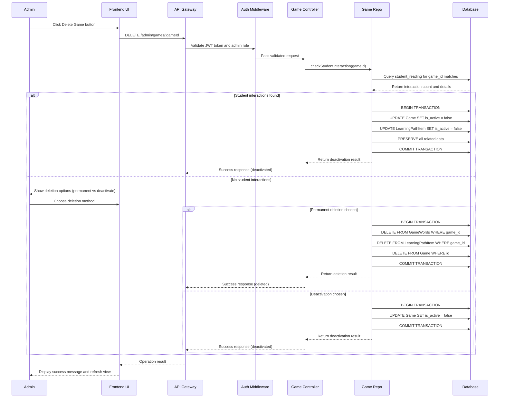
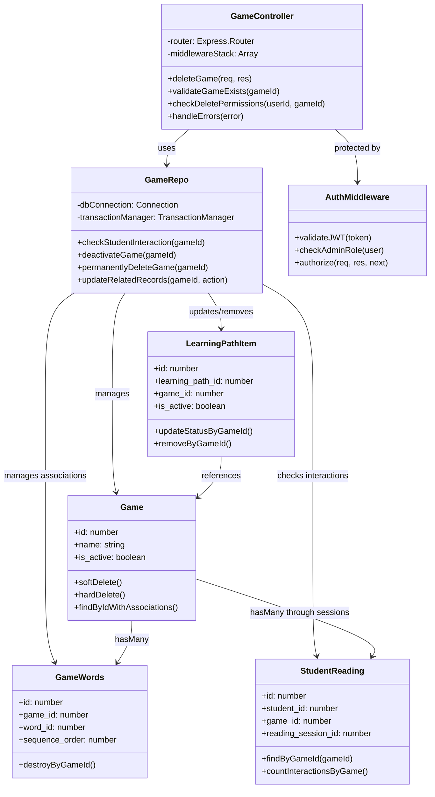

# UC_G04: Delete Game

## Use Case Details

### 1. USE CASE DETAILS

**Primary Actors**
Admin

**Secondary Actors**
None

**Trigger**
The Admin clicks the "Delete" or "Remove" button for a specific game from - **MSG_38, MSG_40, MSG_42** - Hiển thị khi:
- Student interaction check fails or constraint violations occur (steps 2-6)
- Concurrent modifications detected during operationame detail view or "Delete" action button from the learning path games list .

**Description**
As an Admin, I want to delete or deactivate a game from the system, so that I can remove outdated, incorrect, or inappropriate content while preserving student progress data when necessary. The system intelligently determines whether to deactivate (if students have interacted with the game) or permanently delete (if no student interaction exists).

**Preconditions**
- The user must be authenticated with an Admin account and logged into the system
- The user must have access to Game Management or Learning Path Management sections
- The selected game must exist in the database and be accessible to the admin
- The system must be connected to the database to check student interaction records
- The game may have existing associations with GameWords, LearningPathItems, and student interaction records

**Postconditions**
- If students have previously played the game: Game is deactivated (is_active = false) and all related data is preserved
- If no student interaction exists: Game can be permanently deleted with all related GameWords associations removed
- Related LearningPathItems referencing this game are updated accordingly
- The user receives appropriate notification about the action taken (MSG_19 or MSG_20)
- The system returns to the previous view with updated game list showing the changes
- Data integrity is maintained across all related tables through proper transaction handling

### 2. NORMAL SEQUENCE/FLOW

1. **The Admin clicks "Delete Game" from a game detail view or games list.**
2. **The system validates game access permissions and checks for existing student interactions:**
   - This verifies that if any student has played the game, it cannot be deleted but can be deactivated
   - Verifies the game exists and admin has delete permissions
3. **The system determines the appropriate action based on student interaction history:**
   - **If students have previously played this game:** System prepares deactivation process
   - **If no students have played this game:** System prepares permanent deletion process
4. **The system shows context-aware confirmation dialog:**
   - **With student interaction found:** "Students have accessed this game. Are you sure you want to deactivate it? (Student data will be preserved)"
   - **Without student interaction:** "Are you sure you want to permanently delete this game? This action cannot be undone."
5. **The Admin confirms the action by clicking "Deactivate" or "Delete Permanently".**
6. **The system starts a database transaction and performs the appropriate operations:**
   - **For deactivation:** Updates game.is_active = false, preserves all related data
   - **For deletion:** Removes game record and all GameWords associations
   - Updates or removes related LearningPathItems accordingly
   - Maintains referential integrity across all related tables
7. **If all operations succeed, the system commits the transaction.**
8. **The system displays appropriate success message and updates the interface.**
9. **The system returns to the previous view with refreshed data showing the updated games list.**

### 3. ALTERNATIVE SEQUENCE/FLOW

**Alternative 1 - Cancel Operation:**
- **Điều kiện kích hoạt:** At any step, Admin clicks "Cancel" button or closes confirmation dialog
- **Các bước thực hiện:**
  - System discards the delete/deactivate operation
  - System returns to previous view without making any changes
- **Kết quả:** No changes are made to the game or related data

### 4. EXCEPTION SEQUENCE/FLOW

**Steps 2-3: Initial Validation Errors:**
- **Game not found:** Display (MSG_27) "Game not found or may have been deleted"
- **Access denied:** Display (MSG_36) "You don't have permission to delete this game"
- **Game already inactive:** Display (MSG_37) "This game is already deactivated"

**Steps 6-7: Database Operation Errors:**
- **Student interaction check failure:** Display (MSG_38) "Unable to verify student interaction data"
- **Transaction failure during deactivation:** Display (MSG_20) "Failed to deactivate game. Please try again"
- **Transaction failure during deletion:** Display (MSG_39) "Failed to delete game. Please try again"
- **Constraint violation:** Display (MSG_40) "Cannot delete game due to system constraints"

**Steps 6-8: System-level Errors:**
- **Network connection failure:** Display (MSG_21) "Connection error. Please try again"
- **Database transaction rollback:** Display (MSG_41) "Operation failed and changes were undone"
- **Concurrent modification:** Display (MSG_42) "Game was modified by another user. Please refresh and try again"

## Mockup Design

### 5. MOCKUP DESIGN

```
┌─────────────────────────────────────────────────────────────────────────────────────┐
│                         Delete Game: "Animal Matching Game"                         │
├─────────────────────────────────────────────────────────────────────────────────────┤
│                                                                                     │
│  ⚠️  Student Interaction Detected                                                   │
│                                                                                     │
│  ┌─────────────────────────────────────────────────────────────────────────────┐   │
│  │ 📊 This game has been accessed by students                                 │   │
│  │                                                                             │   │
│  │ • 15 student reading sessions recorded                                     │   │
│  │ • 8 students have completed this game                                      │   │
│  │ • Last access: 2 days ago                                                  │   │
│  │                                                                             │   │
│  │ ⚠️  This game cannot be permanently deleted                                │   │
│  │     It will be deactivated to preserve student progress data               │   │
│  └─────────────────────────────────────────────────────────────────────────────┘   │
│                                                                                     │
│  🎮 Game Information                                                                │
│  ┌─────────────────────────────────────────────────────────────────────────────┐   │
│  │ Name: Animal Matching Game                                                  │   │
│  │ Type: Matching Game                                                         │   │
│  │ Status: Active                                                              │   │
│  │ Used in: Basic English Reading Path (Position #2)                          │   │
│  │ Associated Words: 4 vocabulary words                                        │   │
│  └─────────────────────────────────────────────────────────────────────────────┘   │
│                                                                                     │
│                                                                                     │
│                                           [Cancel] [Deactivate Game]               │
└─────────────────────────────────────────────────────────────────────────────────────┘

┌─────────────────────────────────────────────────────────────────────────────────────┐
│                        Delete Game: "Unused Word Quiz"                             │
├─────────────────────────────────────────────────────────────────────────────────────┤
│                                                                                     │
│  🗑️  Permanent Deletion Available                                                  │
│                                                                                     │
│  ┌─────────────────────────────────────────────────────────────────────────────┐   │
│  │ ✅ No student interaction detected                                          │   │
│  │                                                                             │   │
│  │ • 0 student reading sessions                                               │   │
│  │ • 0 students have accessed this game                                       │   │
│  │ • Created: 1 week ago, never used                                          │   │
│  │                                                                             │   │
│  │ 🗑️  This game can be permanently deleted                                  │   │
│  │     All game data and associations will be removed                          │   │
│  └─────────────────────────────────────────────────────────────────────────────┘   │
│                                                                                     │
│  🎮 Game Information                                                                │
│  ┌─────────────────────────────────────────────────────────────────────────────┐   │
│  │ Name: Unused Word Quiz                                                      │   │
│  │ Type: Quiz Game                                                             │   │
│  │ Status: Active (unused)                                                     │   │
│  │ Associated Words: 2 vocabulary words                                        │   │
│  └─────────────────────────────────────────────────────────────────────────────┘   │
│                                                                                     │
│  ⚠️ Choose deletion method:                                                         │
│  ┌─────────────────────────────────────────────────────────────────────────────┐   │
│  │ ● Permanent Delete - Remove completely (recommended for unused games)       │   │
│  │ ○ Deactivate Only - Keep for potential future use                          │   │
│  └─────────────────────────────────────────────────────────────────────────────┘   │
│                                                                                     │
│                                           [Cancel] [Delete Permanently]            │
└─────────────────────────────────────────────────────────────────────────────────────┘
```

### 6. UI ELEMENTS DESCRIPTION

**Student Interaction Detection Section:**
- **Interaction Alert:** Visual indicator showing student usage status with icon
- **Usage Statistics:** Shows student reading sessions, completion count, last access date
- **Action Determination:** Clear explanation of why deactivation vs deletion is required

**Game Information Display:**
- **Basic Info:** Game name, type, current status, and position in learning paths
- **Association Summary:** Shows vocabulary words count and learning path usage
- **Impact Assessment:** Details what will be preserved or removed

**Confirmation Interface:**
- **Action Selection:** Radio buttons for permanent delete vs deactivate (when applicable)
- **Consequence Explanation:** Clear list of what will happen with each action
- **Cancel/Confirm Buttons:** Context-aware labeling based on action type

**Progress Indicators:**
- **Loading State:** Shows progress during student interaction checking
- **Success/Error States:** Visual feedback for operation completion
- **Navigation:** Clear return path to previous view

## Error Messages & Validation Messages

### 7. ERROR MESSAGES & VALIDATION MESSAGES

#### Messages
- **MSG_19:** "Game deactivated successfully. Student progress data has been preserved"
- **MSG_20:** "Failed to deactivate game. Please try again"
- **MSG_21:** "Connection error. Please try again"
- **MSG_27:** "Game not found or may have been deleted"
- **MSG_36:** "You don't have permission to delete this game"
- **MSG_37:** "This game is already deactivated"
- **MSG_38:** "Unable to verify student interaction data"
- **MSG_39:** "Failed to delete game. Please try again"
- **MSG_40:** "Cannot delete game due to system constraints"
- **MSG_41:** "Operation failed and changes were undone"
- **MSG_42:** "Game was modified by another user. Please refresh and try again"
- **MSG_43:** "Game deleted permanently. All associated data has been removed"

#### When These Messages Occur

**MSG_19** - Hiển thị khi:
- Game deactivation transaction commits successfully (students have played the game)
- After step 8 when deactivation path is taken
- Appears as success toast notification with preservation confirmation

**MSG_43** - Hiển thị khi:
- Game permanent deletion transaction commits successfully (no student interaction)
- After step 8 when deletion path is taken
- Appears as success toast notification

**MSG_20, MSG_39** - Hiển thị khi:
- Database transaction fails during deactivation or deletion (steps 6-7)
- Rollback occurs due to constraint violations or system errors

**MSG_21, MSG_41** - Hiển thị khi:
- System-level errors occur during operation (steps 6-8)
- Network connection issues or transaction rollback scenarios

**MSG_27** - Hiển thị khi:
- Game ID doesn't exist when operation is initiated (step 2)
- Game has been deleted by another user during confirmation process

**MSG_36, MSG_37** - Hiển thị khi:
- Authorization or state validation fails (steps 2-3)
- Admin lacks permissions or game is already in target state

**MSG_38, MSG_40, MSG_42** - Hiển thị khi:
- Student interaction check fails or constraint violations occur (steps 2-6)
- Concurrent modifications detected during operation

## Business Rules Applied to UC_G04

### 8. BUSINESS RULES APPLIED TO UC_G04

| ID | Business Rule | Description | Implementation |
|----|---------------|-------------|----------------|
| **BR_1** | Student data preservation required | Games with student interaction history must be deactivated, not deleted | Check student interaction before action determination |
| **BR_2** | Transaction required for DELETE/UPDATE operations | All operations must use database transaction | Sequelize transaction wrapper with rollback |
| **BR_3** | Admin authorization required | Only authenticated admin users can delete/deactivate games | JWT + Role middleware validation |
| **BR_4** | Referential integrity maintenance | GameWords and LearningPathItems must be handled consistently | CASCADE delete or status update in transaction |
| **BR_5** | Audit trail preservation | Historical data must remain accessible for reporting | Soft delete (deactivation) preserves audit trails |
| **BR_6** | Data consistency across tables | Related table updates must be atomic | Transaction includes all affected tables |
| **BR_7** | Permission-based action determination | Action type determined by data state, not user preference | System enforces deactivation when student data exists |
| **BR_8** | Concurrent modification protection | Prevent race conditions during delete operations | Optimistic locking or version checking |

## Technical Implementation Notes

### 9. TECHNICAL IMPLEMENTATION NOTES

#### Required API Endpoint
- `DELETE /admin/games/:gameId` - Delete or deactivate game based on student interaction

#### API Request Contract
```javascript
DELETE /admin/games/:gameId
Content-Type: application/json
Authorization: Bearer <JWT_TOKEN>

// Path parameters
// :gameId - ID of the game to delete/deactivate

// Optional query parameters
// ?force_deactivate=true - Force deactivation even if deletion is possible
```

#### API Response Contract
```javascript
// Success Response - Deactivation (200)
{
  "statusCode": 200,
  "message": "Game deactivated successfully. Student progress data has been preserved",
  "data": {
    "action": "deactivated",
    "id": 123,
    "student_interactions_found": true,
    "reading_sessions_count": 15,
    "affected_students": 8,
    "preservation_details": {
      "student_interaction_records": "preserved",
      "learning_path_associations": "maintained",
      "game_words": "preserved"
    }
  }
}

// Success Response - Permanent Deletion (200)
{
  "statusCode": 200,
  "message": "Game deleted permanently. All associated data has been removed",
  "data": {
    "action": "deleted",
    "id": 123,
    "student_interactions_found": false,
    "removed_associations": {
      "game_words": 4,
      "learning_path_items": 1
    }
  }
}

// Error Response (400/403/404/500)
{
  "statusCode": 403,
  "message": "You don't have permission to delete this game",
  "data": null
}
```

#### Database Operations Required
- **Student interaction check:** Verify if students have previously played this game
- **Transaction pattern:** Use Sequelize transaction for atomic operations
- **Models involved:** Game, GameWords, LearningPathItem, StudentReading
- **Conditional logic:** IF student interaction EXISTS THEN deactivate ELSE delete
- **Cascade handling:** Proper cleanup of related records based on action type

#### Security & Performance Considerations
- **Authentication:** JWT token validation with admin role check
- **Authorization:** Verify admin has permission to delete/deactivate specific game
- **Data validation:** Ensure game exists and is accessible before operation
- **Transaction handling:** Proper rollback on any operation failure
- **Audit logging:** Record all delete/deactivate operations for compliance

## Diagram Components Overview

### 10. DIAGRAM COMPONENTS OVERVIEW

#### Sequence Diagram



#### Class Diagram



## Notes

### 11. NOTES

- **Key Logic Change:** Primary business rule now checks student_reading table for game_id matches to determine if deactivation (instead of deletion) is required
- **Data Preservation Priority:** Student interaction data takes precedence over admin deletion preference - system enforces deactivation when student_reading records exist
- **Smart Action Determination:** System automatically determines appropriate action (deactivate vs delete) based on student_reading table query results
- **Dependencies:** This use case depends on:
  - student_reading table containing accurate game interaction records
  - Valid game existing in system with proper access permissions
  - GameWords and LearningPathItem associations for cleanup operations
- **Context preservation:**
  - When deactivating: All student progress, learning path context, and historical data preserved
  - When deleting: Only possible if no student interaction exists, removes all related data
  - Transaction ensures atomic operations across all affected tables
- **Future enhancements:**
  - Scheduled cleanup jobs for games deactivated beyond retention period
  - Advanced student impact analysis before deactivation
  - Bulk deactivation/deletion operations with smart action determination
  - Game archival system for long-term deactivated games
- **Known limitations:**
  - Cannot permanently delete games with any student interaction history
  - Deactivated games remain in database indefinitely (no automatic cleanup)
  - Admin cannot override system determination when student data exists
- **Integration requirements:**
  - Real-time checking of student_reading table for accurate interaction detection
  - Integration with Student Progress system to assess learning impact
  - Connection to Learning Path Management for proper association handling
- **Special considerations:**
  - student_reading table check is performed at operation time to ensure current accuracy
  - Transaction handling ensures either complete success or complete rollback
  - Concurrent deletion protection prevents race conditions between multiple admins
  - Audit trail maintained for all deactivation/deletion operations for compliance tracking