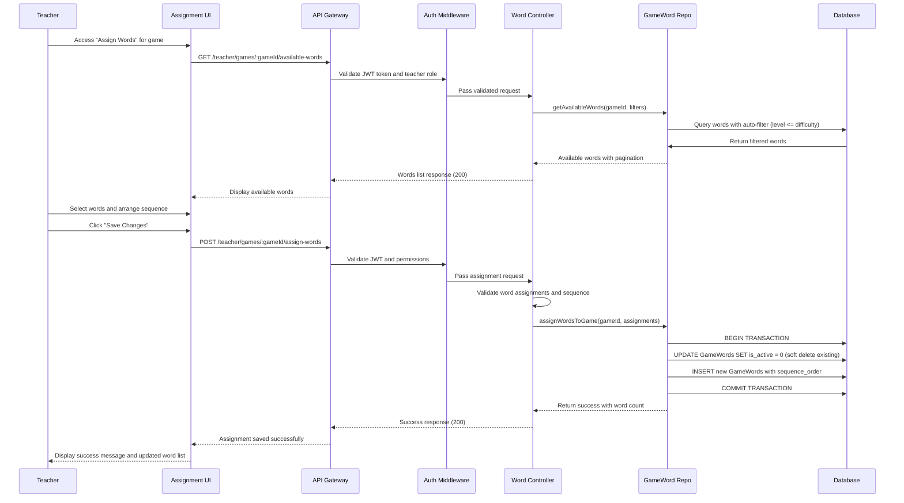
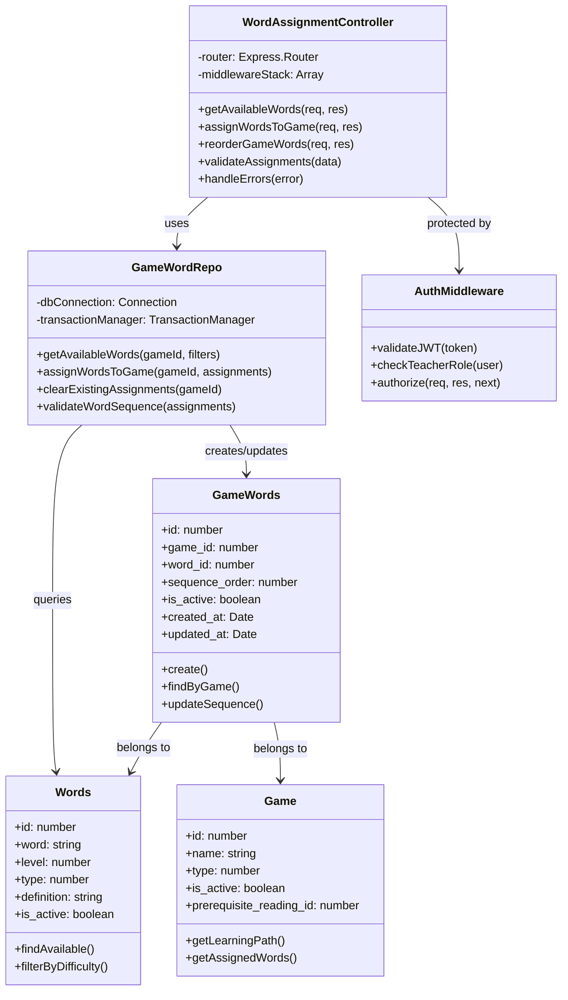

# UC_G05: Assign Words to Game

## Use Case Details

### 1. USE CASE DETAILS

**Primary Actors**
Teacher

**Secondary Actors**
None

**Trigger**
The Teacher clicks on the "Assign Words" button while viewing or editing a specific game in the learning path management interface.

**Description**
As a Teacher, I want to assign vocabulary words to a game with automatic filtering by difficulty level, so that I can create appropriate word lists for students while maintaining learning path difficulty consistency. The system provides drag & drop reordering, search/filter capabilities, and manages word sequence within the game.

**Preconditions**
- The user must be authenticated with a Teacher account and logged into the system
- The user must have access to game management functionality
- A game must already exist and be associated with a learning path
- Vocabulary words must be available in the system database

**Postconditions**
- Words are assigned to the game with proper sequence_order values
- Game-word associations are saved in the GameWords table
- Words display in the specified order within the game interface
- Auto-filtering by difficulty level is applied and maintained

### 2. NORMAL SEQUENCE/FLOW

1. **The Teacher navigates to Game Management and clicks "Assign Words" for a specific game.**
2. **The system loads the word assignment interface and applies auto-filtering:**
   - Retrieves the difficulty_level from the learning path containing the game
   - Automatically filters words where level ≤ learning_path.difficulty_level  
   - Displays available words list (left panel) with filter applied
   - Shows currently assigned words (right panel) with sequence order
3. **The Teacher reviews available words and uses search/filter capabilities:**
   - Searches by word name in the available words list
   - Applies additional filters by word type or level (within auto-filter constraints)
   - Reviews word definitions and difficulty indicators
4. **The Teacher selects words to add to the game:**
   - Clicks "Add" button next to desired words to move them from available → selected
   - Words are automatically assigned the next sequence_order number
   - Selected words appear in the right panel with drag handles for reordering
5. **The Teacher organizes word sequence using drag & drop:**
   - Drags words within the selected list to change order
   - System updates sequence_order values automatically during drag operations
   - Optionally removes words by clicking "Remove" button
6. **The Teacher saves the word assignments:**
   - Clicks "Save Changes" button to commit all modifications
   - System validates the assignment data and shows any validation errors
7. **If validation passes, the system performs database operations:**
   - Starts a database transaction
   - Clears existing GameWords entries for the game (sets is_active = 0)
   - Creates new GameWords entries with updated word assignments and sequence orders
   - Commits the transaction if all operations succeed
8. **The system displays success message (MSG_1) and updates the interface.**
9. **The system refreshes the word assignment interface showing the updated word list.**

### 3. ALTERNATIVE SEQUENCE/FLOW

**Alternative 1 - Override Auto-Filter:**
- **Điều kiện kích hoạt:** Teacher clicks "Show All Difficulty Levels" checkbox to override auto-filtering
- **Các bước thực hiện:** 
  - System displays warning dialog about difficulty compatibility (MSG_10)
  - Teacher confirms to proceed with override
  - System shows all active words with difficulty level indicators
  - Recommended words (matching difficulty) are highlighted
- **Kết quả:** All available words are displayed, teacher can assign any words to game

**Alternative 2 - Cancel Operation:**
- **Điều kiện kích hoạt:** At any step, Teacher clicks "Cancel" button or navigates away
- **Các bước thực hiện:** 
  - System discards all unsaved changes without committing to database
  - System shows confirmation dialog if there are unsaved changes
- **Kết quả:** System returns to previous screen with no changes applied

**Alternative 3 - Game Already Has Words:**
- **Điều kiện kích hoạt:** Game contains existing word assignments when interface loads
- **Các bước thực hiện:** 
  - System loads existing GameWords relationships in sequence order
  - Right panel displays current word assignments with proper sequence numbering
  - New word additions append to the end of existing sequence
- **Kết quả:** Existing words are preserved, new assignments are added incrementally

### 4. EXCEPTION SEQUENCE/FLOW

**Steps 6-7: Validation Errors (After Save Click):**
- **No words selected:** Display (MSG_5) "Please select at least one word to assign"
- **Invalid sequence order:** Display (MSG_6) "Word sequence order contains duplicates or gaps"
- **Word no longer available:** Display (MSG_7) "One or more selected words are no longer available"

**Steps 7-8: Business Logic Errors:**
- **Game inactive:** Display (MSG_11) "Cannot assign words to inactive game"
- **Learning path difficulty changed:** Display (MSG_12) "Learning path difficulty has changed. Please refresh and retry"

**Steps 7-9: System-level Errors:**
- **Network connection failure:** Display (MSG_14) "Connection error. Please try again"
- **Database transaction failure:** Display (MSG_15) "Server error occurred. Word assignments were not saved"
- **Transaction rollback:** Display (MSG_16) "Word assignment failed and changes were undone"
1. Detect conflict on save attempt
2. Show updated state with conflicts highlighted
3. Allow teacher to review và re-apply changes

### Exception Flow 3: Game Becomes Inactive
**Trigger:** Game được deactivated while editing
1. Show warning: "Game has been deactivated"
2. Disable save functionality
3. Redirect to game list

## Mockup Design

### 5. MOCKUP DESIGN

```
┌─────────────────────────────────────────────────────────────────────────────────────┐
│                         Assign Words to Game: "Animal Matching"                     │
├─────────────────────────────────────────────────────────────────────────────────────┤
│                                                                                     │
│  🎯 Learning Path: "Basic English Reading Path" (Difficulty: Level 2)              │
│  ⚙️ Auto-filter: Showing words Level ≤ 2  [☐ Show All Levels]                     │
│                                                                                     │
│  ┌───────────────────────────────────┬───────────────────────────────────────────┐ │
│  │          AVAILABLE WORDS          │           SELECTED WORDS                  │ │
│  │                                   │                                           │ │
│  │  🔍 Search: [____________] [🔎]   │  📊 Game Words (5 selected)              │ │
│  │  📊 Filters: [Level ▼][Type ▼]   │                                           │ │
│  │                                   │  ┌─────────────────────────────────────┐ │ │
│  │  ┌─────────────────────────────┐   │  │ 1. 🐶 dog        [≡] [Remove]     │ │ │
│  │  │ 🐱 cat (Level 1, Noun)     │   │  │ 2. � cat        [≡] [Remove]     │ │ │
│  │  │    "A small furry animal"   │   │  │ 3. � fish       [≡] [Remove]     │ │ │
│  │  │    [Add to Game →]          │   │  │ 4. � bird       [≡] [Remove]     │ │ │
│  │  └─────────────────────────────┘   │  │ 5. � rabbit     [≡] [Remove]     │ │ │
│  │  ┌─────────────────────────────┐   │  └─────────────────────────────────────┘ │ │
│  │  │ 🏃 run (Level 1, Verb)     │   │                                           │ │
│  │  │    "To move quickly..."     │   │  💡 Drag words to reorder sequence      │ │
│  │  │    [Add to Game →]          │   │                                           │ │
│  │  └─────────────────────────────┘   │                                           │ │
│  │  ┌─────────────────────────────┐   │                                           │ │
│  │  │ 🏠 house (Level 2, Noun)   │   │                                           │ │
│  │  │    "A building for living"  │   │                                           │ │
│  │  │    [Add to Game →]          │   │                                           │ │
│  │  └─────────────────────────────┘   │                                           │ │
│  │                                   │                                           │ │
│  │  📄 Showing 18 of 85 words       │                                           │ │
│  │  [Previous] [1] [2] [3] [Next]    │                                           │ │
│  └───────────────────────────────────┴───────────────────────────────────────────┘ │
│                                                                                     │
├─────────────────────────────────────────────────────────────────────────────────────┤
│                        [Cancel]  [Reset Changes]  [Save Changes]                   │
└─────────────────────────────────────────────────────────────────────────────────────┘
```

### Difficulty Override Warning Dialog

```
┌─────────────────────────────────────────────────────────────────────────────────────┐
│                              ⚠️ Difficulty Level Warning                           │
├─────────────────────────────────────────────────────────────────────────────────────┤
│                                                                                     │
│  You are about to show words above the recommended difficulty level.               │
│                                                                                     │
│  📊 Current Learning Path: "Basic English Reading Path"                            │
│  🎯 Learning Path Difficulty: Level 2                                              │
│  ⚠️  You're requesting: All difficulty levels (1-5)                               │
│                                                                                     │
│  Using words above Level 2 may be too challenging for students in this             │
│  learning path and could negatively impact their learning experience.              │
│                                                                                     │
│  💡 Recommended: Use words with Level ≤ 2 for optimal learning outcomes            │
│                                                                                     │
├─────────────────────────────────────────────────────────────────────────────────────┤
│                      [Keep Current Filter]  [Show All Words Anyway]                │
└─────────────────────────────────────────────────────────────────────────────────────┘
```

### 6. UI ELEMENTS DESCRIPTION

**Left Panel - Available Words:**
- **Search Box:** Real-time search with minimum 2 characters, debounced input
- **Filter Dropdowns:** Level (1-5), Type (Noun/Verb/Adjective), with "All" options
- **Word Cards:** Display word, level indicator, type badge, definition preview
- **Add Buttons:** Individual "Add to Game" buttons for each available word
- **Pagination:** Page controls for large word lists, showing items per page
- **Override Toggle:** Checkbox to "Show All Difficulty Levels" with warning

**Right Panel - Selected Words:**
- **Sequence List:** Numbered list showing current word assignments with drag handles
- **Remove Buttons:** Individual remove buttons for each assigned word
- **Drag Indicators:** Visual handles (≡) for drag & drop reordering
- **Counter Display:** Shows total selected words count
- **Reorder Instructions:** Helper text explaining drag & drop functionality

**Control Buttons:**
- **Save Changes:** Primary action button, validates and commits word assignments
- **Reset Changes:** Reverts to last saved state, discards unsaved modifications
- **Cancel:** Returns to game management without saving, shows confirmation if changes exist

## Error Messages & Validation Messages

### 7. ERROR MESSAGES & VALIDATION MESSAGES

#### Messages
- **MSG_1:** "Word assignments saved successfully"
- **MSG_5:** "Please select at least one word to assign"
- **MSG_6:** "Word sequence order contains duplicates or gaps"
- **MSG_7:** "One or more selected words are no longer available"
- **MSG_10:** "Warning: You are about to show words above recommended difficulty level"
- **MSG_11:** "Cannot assign words to inactive game"
- **MSG_12:** "Learning path difficulty has changed. Please refresh and retry"
- **MSG_14:** "Connection error. Please try again"
- **MSG_15:** "Server error occurred. Word assignments were not saved"
- **MSG_16:** "Word assignment failed and changes were undone"

#### When These Messages Occur

**MSG_1** - Hiển thị khi:
- Word assignment transaction commits successfully
- After step 8 in Normal Sequence/Flow
- Appears as success toast notification with word count

**MSG_5** - Hiển thị khi:
- User attempts to save form without selecting any words (step 6-7)

**MSG_6** - Hiển thị khi:
- System detects invalid sequence_order values during save validation (step 6-7)

**MSG_7** - Hiển thị khi:
- Selected words have been deactivated/deleted since loading (step 6-7)

**MSG_10** - Hiển thị khi:
- Teacher attempts to override auto-filter to show higher difficulty words (Alternative 1)

**MSG_11** - Hiển thị khi:
- Game becomes inactive while user is making assignments (step 7-8)

**MSG_12** - Hiển thị khi:
- Learning path difficulty_level changes during assignment session (step 7-8)

**MSG_14, MSG_15, MSG_16** - Hiển thị khi:
- System-level errors occur during transaction (step 7-9)

## Business Rules Applied to UC_G05

### 8. BUSINESS RULES APPLIED TO UC_G05

| ID | Business Rule | Description | Implementation |
|----|---------------|-------------|----------------|
| **BR_1** | Transaction required for UPDATE operations | All word assignment operations must use database transaction | Sequelize transaction wrapper with rollback |
| **BR_2** | Teacher authorization required | Only authenticated teacher users can assign words to games | JWT + Role middleware validation |
| **BR_3** | Input validation at controller | All word assignment data must be validated at controller level | Express-validator middleware |
| **BR_4** | Auto-filtering by difficulty | Words filtered by learning path difficulty_level by default | WHERE level <= learning_path.difficulty_level |
| **BR_5** | Unique sequence ordering | Words in game must have unique, sequential sequence_order values | Database constraint + validation logic |
| **BR_6** | Active words only | Only active words (is_active = 1) can be assigned to games | Database query filtering |
| **BR_7** | Response format standardization | Use messageManager for consistent responses | MessageManager.success/error methods |
| **BR_8** | Soft delete for assignments | GameWords use soft delete (is_active flag) instead of hard delete | Update is_active = 0 instead of DELETE |

## Technical Implementation Notes

### 9. TECHNICAL IMPLEMENTATION NOTES

#### Required API Endpoints
- `GET /teacher/games/:gameId/available-words` - Get available words with auto-filtering
- `GET /teacher/games/:gameId/assigned-words` - Get currently assigned words with sequence
- `POST /teacher/games/:gameId/assign-words` - Assign words to game with sequence management
- `PUT /teacher/games/:gameId/reorder-words` - Update word sequence order via drag & drop

#### API Request Contract
```javascript
GET /teacher/games/:gameId/available-words
Content-Type: application/json
Authorization: Bearer <JWT_TOKEN>

// Query parameters
// ?search=string (optional, minimum 2 chars)
// ?level=number (optional, 1-5)
// ?type=number (optional, 0-2)
// ?show_all_levels=boolean (optional, default false)
// ?page=number (optional, default 1)
// ?limit=number (optional, default 20)

POST /teacher/games/:gameId/assign-words
Content-Type: application/json
Authorization: Bearer <JWT_TOKEN>

// Request body format
{
  "word_assignments": [
    {
      "word_id": 123,
      "sequence_order": 1
    },
    {
      "word_id": 456,
      "sequence_order": 2
    }
  ]
}
```

#### API Response Contract  
```javascript
// GET available-words Success Response (200)
{
  "statusCode": 200,
  "message": "Available words loaded successfully",
  "data": {
    "words": [
      {
        "id": 123,
        "word": "cat",
        "level": 1,
        "type": 0,
        "definition": "A small furry animal",
        "pronunciation": "/kæt/"
      }
    ],
    "pagination": {
      "total_records": 85,
      "total_pages": 5,
      "current_page": 1,
      "per_page": 20
    },
    "filter_info": {
      "max_difficulty": 2,
      "show_all_levels": false,
      "learning_path": "Basic English Reading Path"
    }
  }
}

// POST assign-words Success Response (200)
{
  "statusCode": 200,
  "message": "Word assignments saved successfully",
  "data": {
    "assigned_words": 5,
    "total_words": 12,
    "game_id": 78
  }
}
```

#### Database Operations Required
- **Transaction pattern:** Use Sequelize transaction for atomic word assignment operations
- **Models involved:** Game, Words, GameWords, LearningPath, LearningPathItem
- **Auto-filtering implementation:** JOIN with LearningPath through Game → LearningPathItem relationship
- **Sequence management:** Calculate and validate sequence_order values during assignment
- **Soft delete pattern:** Update GameWords.is_active = 0 instead of DELETE for existing assignments

#### Security & Performance Considerations
- **Authentication:** JWT token validation with teacher role check
- **Input validation:** Sanitize word IDs, validate sequence_order ranges and uniqueness  
- **Database:** Use prepared statements, validate foreign key references for game_id and word_id
- **Performance:** Paginate available words list, debounce search queries, cache filter results
- **Transaction handling:** Proper rollback on any operation failure, batch operations for multiple words

### Auto-Filter Implementation

```javascript
// Get available words with auto-filter
async function getAvailableWordsForGame(req, res) {
  try {
    const gameId = req.params.gameId;
    
    // Get game with learning path info
    const game = await Game.findByPk(gameId, {
      include: [{
        model: LearningPathItem,
        include: [{
          model: LearningPath,
          attributes: ['id', 'name', 'difficulty_level']
        }]
      }]
    });
    
    if (!game || !game.learningPathItem) {
      return responseManager.notFound(res, "Game not found in learning path");
    }
    
    const maxDifficulty = game.learningPathItem.learningPath.difficulty_level;
    const showAllLevels = req.query.show_all_levels === 'true';
    
    // Build where clause with auto-filter
    const whereClause = {
      is_active: 1
    };
    
    // Apply difficulty filter unless overridden
    if (!showAllLevels) {
      whereClause.level = {
        [Op.lte]: maxDifficulty
      };
    }
    
    // Add search filters
    if (req.query.search) {
      whereClause.word = {
        [Op.iLike]: `%${req.query.search}%`
      };
    }
    
    if (req.query.level) {
      whereClause.level = parseInt(req.query.level);
    }
    
    if (req.query.type !== undefined) {
      whereClause.type = parseInt(req.query.type);
    }
    
    // Get available words (excluding already assigned)
    const assignedWordIds = await GameWords.findAll({
      where: { game_id: gameId, is_active: 1 },
      attributes: ['word_id'],
      raw: true
    }).then(rows => rows.map(r => r.word_id));
    
    if (assignedWordIds.length > 0) {
      whereClause.id = {
        [Op.notIn]: assignedWordIds
      };
    }
    
    // Query with pagination
    const { page = 1, limit = 20 } = req.query;
    const offset = (page - 1) * limit;
    
    const result = await Words.findAndCountAll({
      where: whereClause,
      order: [['word', 'ASC']],
      limit: parseInt(limit),
      offset: offset,
      attributes: ['id', 'word', 'level', 'type', 'definition', 'pronunciation']
    });
    
    return responseManager.success(res, {
      words: result.rows,
      pagination: {
        total_records: result.count,
        total_pages: Math.ceil(result.count / limit),
        current_page: parseInt(page),
        per_page: parseInt(limit)
      },
      filter_info: {
        max_difficulty: maxDifficulty,
        show_all_levels: showAllLevels,
        learning_path: game.learningPathItem.learningPath.name
      }
    });
    
  } catch (error) {
    logger.error('Get available words failed:', error);
    return responseManager.internalError(res, "Unable to load words");
  }
}
```

### Word Assignment Management

```javascript
// Assign words to game with sequence management
async function assignWordsToGame(req, res) {
  const transaction = await sequelize.transaction();
  
  try {
    const gameId = req.params.gameId;
    const { word_assignments } = req.body;
    
    // Validate game exists and is active
    const game = await Game.findOne({
      where: { id: gameId, is_active: 1 }
    });
    
    if (!game) {
      await transaction.rollback();
      return responseManager.notFound(res, "Game not found or inactive");
    }
    
    // Clear existing assignments
    await GameWords.update(
      { is_active: 0 },
      {
        where: { game_id: gameId },
        transaction
      }
    );
    
    // Validate word assignments
    const wordIds = word_assignments.map(wa => wa.word_id);
    const validWords = await Words.findAll({
      where: {
        id: { [Op.in]: wordIds },
        is_active: 1
      },
      attributes: ['id'],
      transaction
    });
    
    const validWordIds = validWords.map(w => w.id);
    const invalidWords = wordIds.filter(id => !validWordIds.includes(id));
    
    if (invalidWords.length > 0) {
      await transaction.rollback();
      return responseManager.badRequest(res, 
        `Invalid word IDs: ${invalidWords.join(', ')}`
      );
    }
    
    // Create new assignments with sequence order
    const gameWordRecords = word_assignments.map((assignment, index) => ({
      game_id: gameId,
      word_id: assignment.word_id,
      sequence_order: assignment.sequence_order || (index + 1),
      is_active: 1,
      created_at: new Date(),
      updated_at: new Date()
    }));
    
    await GameWords.bulkCreate(gameWordRecords, { transaction });
    
    await transaction.commit();
    
    // Get updated word count
    const wordCount = await GameWords.count({
      where: { game_id: gameId, is_active: 1 }
    });
    
    return responseManager.success(res, {
      message: "Word assignments updated successfully",
      assigned_words: word_assignments.length,
      total_words: wordCount
    });
    
  } catch (error) {
    await transaction.rollback();
    logger.error('Assign words to game failed:', error);
    return responseManager.internalError(res, "Failed to assign words");
  }
}
```

### Drag & Drop Reordering

```javascript
// Handle word reordering via drag & drop
async function reorderGameWords(req, res) {
  const transaction = await sequelize.transaction();
  
  try {
    const gameId = req.params.gameId;
    const { reorder_operations } = req.body;
    
    // Validate reorder operations
    for (const operation of reorder_operations) {
      const { word_id, new_sequence_order } = operation;
      
      await GameWords.update(
        { sequence_order: new_sequence_order },
        {
          where: {
            game_id: gameId,
            word_id: word_id,
            is_active: 1
          },
          transaction
        }
      );
    }
    
    await transaction.commit();
    
    return responseManager.success(res, {
      message: "Word order updated successfully",
      updated_count: reorder_operations.length
    });
    
  } catch (error) {
    await transaction.rollback();
    logger.error('Reorder game words failed:', error);
    return responseManager.internalError(res, "Failed to update word order");
  }
}

// Get current game words with sequence
async function getGameWords(req, res) {
  try {
    const gameId = req.params.gameId;
    
    const gameWords = await GameWords.findAll({
      where: {
        game_id: gameId,
        is_active: 1
      },
      include: [{
        model: Words,
        attributes: ['id', 'word', 'level', 'type', 'definition', 'pronunciation'],
        where: { is_active: 1 }
      }],
      order: [['sequence_order', 'ASC']],
      attributes: ['id', 'word_id', 'sequence_order']
    });
    
    return responseManager.success(res, {
      game_words: gameWords,
      total_count: gameWords.length
    });
    
  } catch (error) {
    logger.error('Get game words failed:', error);
    return responseManager.internalError(res, "Unable to load game words");
  }
}
```

## Diagram Components Overview

### 10. DIAGRAM COMPONENTS OVERVIEW

#### Sequence Diagram



#### Class Diagram



## Notes

### 11. NOTES

- **Dependencies:** This use case depends on:
  - Game must exist and be associated with a learning path for auto-filtering
  - Words must be available in the database with proper difficulty levels
  - GameWords junction table for managing word assignments
- **Context integration:** 
  - Auto-filtering relies on learning path difficulty level through Game → LearningPathItem → LearningPath relationship
  - Word assignments maintain sequence_order for consistent game presentation
  - Integration with word management system for vocabulary availability
- **Future enhancements:** 
  - Batch word assignment from predefined word lists or categories
  - AI-powered word suggestions based on reading content and difficulty
  - Preview mode showing how assigned words will appear in actual game play
  - Copy word assignments between similar games in the same or different learning paths
- **Known limitations:** 
  - Auto-filter can be overridden but requires teacher confirmation with warning
  - Word reordering requires drag & drop interface, no bulk reorder operations
  - Maximum practical limit for words per game (UI performance considerations)
- **Integration requirements:** 
  - Tight integration with Game Management for context and permissions
  - Word Management integration for vocabulary details and availability
  - Learning Path Management for difficulty level determination and override warnings
- **Special considerations:** 
  - Soft delete approach allows for word assignment history and recovery
  - Sequence order management prevents gaps and duplicate positions
  - Performance optimization required for large word databases with pagination and filtering
  - Real-time validation of word availability during assignment process