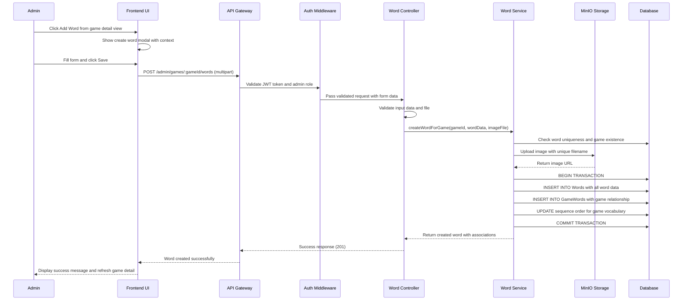
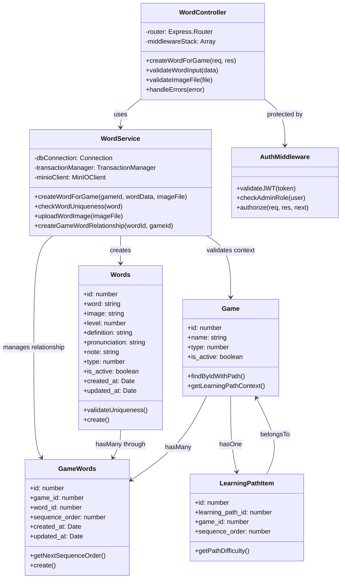

# UC_W01: Create Word

## Use Case Details

### 1. USE CASE DETAILS

**Primary Actors**
Admin

**Secondary Actors**
None

**Trigger**
The Admin clicks the "Add Word" button from a game detail view (UC_G03) while managing vocabulary within a learning path context.

**Description**
As an Admin, I want to create a new vocabulary word in the system database, so that I can expand the vocabulary repository with context-appropriate words that match the learning path's difficulty level for later use in games and learning activities.

**Preconditions**
- The user must be authenticated with an Admin account and logged into the system
- The user must be in the game detail view (UC_G03) of an existing game within a learning path
- The system must have access to the learning path context to determine appropriate difficulty filtering
- The system must be connected to MinIO storage for image uploads
- The admin must have permissions to manage games and vocabulary within the specific learning path

**Postconditions**
- A new word is created and stored in the vocabulary database with all required information
- The word is available in the system vocabulary repository for future use
- The word's difficulty level matches or is appropriate for the learning path's difficulty level
- The user receives a success notification (MSG_15)
- The system returns to the game detail view where admin can later add this word to the game's vocabulary
- Data consistency is maintained across the Words table through transaction handling

### 2. NORMAL SEQUENCE/FLOW

1. **The Admin clicks "Add Word" button from the game detail view within a learning path context.**
2. **The system opens the Create Word modal with context-aware default values:**
   - Auto-populated difficulty level matching the learning path's difficulty level
   - Word Type dropdown with options (0=noun, 1=verb, 2=adjective)
   - Form fields: Word Text, Image Upload, Level, Definition, Pronunciation, Note, Type
   - Context information showing current game and learning path details
3. **The Admin fills in the word information**
4. **The Admin clicks "Save" button to create the word.**
5. **The system validates all form data and shows validation errors if any:**
   - Word Text: not empty, ≤100 chars, unique across system (case-insensitive)
   - Image: required, ≤5MB, valid formats only
   - Definition: ≤1000 chars if provided
   - Pronunciation: ≤255 chars if provided
   - Note: ≤1000 chars if provided
   - Type: must be selected (0, 1, or 2)
   - Level: must be 1-5, with warning if higher than learning path difficulty
6. **If validation fails, system displays appropriate error messages and stops the save process.**
7. **If validation passes, the system starts a database transaction and performs the following operations:**
   - Validates and uploads image to MinIO using uploadToMinIO(file, "words") helper
   - Generates unique filename for uploaded image to prevent conflicts
   - Creates new Word record with all provided information and is_active = true
   - Commits the transaction if all operations succeed
8. **The system displays success message (MSG_15) and updates the interface.**
9. **The system closes the create modal and returns to the game detail view.**
10. **The new word is now available in the vocabulary database for admin to add to games later.**

### 3. ALTERNATIVE SEQUENCE/FLOW

**Alternative 1 - Cancel Operation:**
- **Điều kiện kích hoạt:** At any step, Admin clicks "Cancel" button or closes create modal
- **Các bước thực hiện:**
  - System discards all form data without saving
  - System returns to game detail view without creating any word
- **Kết quả:** No new word is created, game vocabulary remains unchanged

**Alternative 2 - Difficulty Level Override:**
- **Điều kiện kích hoạt:** Admin attempts to set word level higher than learning path difficulty
- **Các bước thực hiện:**
  - System shows warning message about difficulty mismatch
  - Admin can either adjust level or proceed with override
  - System allows override but logs the decision for review
- **Kết quả:** Word is created with specified level despite difficulty mismatch

**Alternative 3 - Duplicate Word Handling:**
- **Điều kiện kích hoạt:** Admin enters word text that already exists in system
- **Các bước thực hiện:**
  - System detects duplicate during validation
  - System shows existing word details and suggests using existing word
  - Admin can either modify text to create new unique word or cancel operation
- **Kết quả:** Either new unique word created or operation cancelled

### 4. EXCEPTION SEQUENCE/FLOW

**Steps 5-6: Form Validation Errors (After Save Click):**
- **Word text empty:** Display (MSG_29) "Word text cannot be empty"
- **Word text too long:** Display (MSG_30) "Word text cannot exceed 100 characters"
- **Word already exists:** Display (MSG_54) "A word with this text already exists"
- **Image not selected:** Display (MSG_50) "Word image is required"
- **Image too large:** Display (MSG_51) "Image size cannot exceed 5MB"
- **Invalid image type:** Display (MSG_55) "Image must be jpeg, jpg, png, gif, or webp format"
- **Level not selected:** Display (MSG_52) "Difficulty level must be selected"
- **Type not selected:** Display (MSG_53) "Word type must be selected"

**Steps 7-8: File Upload Errors:**
- **MinIO upload failure:** Display (MSG_56) "Failed to upload image. Please try again"
- **File validation failure:** Display (MSG_57) "Invalid file format or corrupted image"

**Steps 7-10: System-level Errors:**
- **Network connection failure:** Display (MSG_21) "Connection error. Please try again"
- **Database transaction failure:** Display (MSG_16) "Server error occurred. Word was not created"
- **Transaction rollback:** Display (MSG_58) "Word creation failed and changes were undone"

## Mockup Design

### 5. MOCKUP DESIGN

```
┌─────────────────────────────────────────────────────────────────────────────────────┐
│                               Add Word to Game: "Animal Matching"                   │
├─────────────────────────────────────────────────────────────────────────────────────┤
│                                                                                     │
│  📚 Learning Path Context                                                           │
│  ┌─────────────────────────────────────────────────────────────────────────────┐   │
│  │ Learning Path: Basic English Reading Path (Difficulty: Level 2)             │   │
│  │ Current Game: Animal Matching Game (Position #2)                            │   │
│  │ Current Vocabulary: 4 words                                                 │   │
│  └─────────────────────────────────────────────────────────────────────────────┘   │
│                                                                                     │
│  📝 Word Information                                           [Cancel] [Save]      │
│  ┌─────────────────────────────────────────────────────────────────────────────┐   │
│  │ Word Text *                                                                 │   │
│  │ ┌─────────────────────────────────────────────────────────────────────┐   │   │
│  │ │ elephant                                                            │   │   │
│  │ └─────────────────────────────────────────────────────────────────────┘   │   │
│  │                                                                             │   │
│  │ Word Image * (Max 5MB)                                                      │   │
│  │ ┌─────────────────────────────────────────────────────────────────────┐   │   │
│  │ │ [📁 Browse Files] elephant.jpg (2.3MB) ✓                           │   │   │
│  │ └─────────────────────────────────────────────────────────────────────┘   │   │
│  │                                                                             │   │
│  │ Word Type *                                                                 │   │
│  │ ┌─────────────────────────────────────────────────────────────────────┐   │   │
│  │ │ ● Noun (0)  ○ Verb (1)  ○ Adjective (2)                            │   │   │
│  │ └─────────────────────────────────────────────────────────────────────┘   │   │
│  │                                                                             │   │
│  │ Difficulty Level * (Recommended: 2 for this learning path)                 │   │
│  │ ┌─────────────────────────────────────────────────────────────────────┐   │   │
│  │ │ Level 2 ▼                                                           │   │   │
│  │ └─────────────────────────────────────────────────────────────────────┘   │   │
│  │                                                                             │   │
│  │ Definition                                                                  │   │
│  │ ┌─────────────────────────────────────────────────────────────────────┐   │   │
│  │ │ A large mammal with a trunk and big ears                            │   │   │
│  │ └─────────────────────────────────────────────────────────────────────┘   │   │
│  │                                                                             │   │
│  │ Pronunciation                                                               │   │
│  │ ┌─────────────────────────────────────────────────────────────────────┐   │   │
│  │ │ /ˈɛlɪfənt/                                                          │   │   │
│  │ └─────────────────────────────────────────────────────────────────────┘   │   │
│  │                                                                             │   │
│  │ Usage Note                                                                  │   │
│  │ ┌─────────────────────────────────────────────────────────────────────┐   │   │
│  │ │ Elephants live in Africa and Asia. They are very big animals.       │   │   │
│  │ └─────────────────────────────────────────────────────────────────────┘   │   │
│  └─────────────────────────────────────────────────────────────────────────────┘   │
│                                                                                     │
└─────────────────────────────────────────────────────────────────────────────────────┘
```

### 6. UI ELEMENTS DESCRIPTION

**Learning Path Context Section:**
- **Context Display:** Shows current learning path name, difficulty level, and game position
- **Current Game Info:** Displays game name and current vocabulary count
- **Guidance Information:** Provides context for appropriate word difficulty level

**Word Information Form:**
- **Word Text Field:** Required text input with uniqueness validation, max 100 characters
- **Image Upload Area:** Drag-and-drop or browse interface with file validation preview
- **Word Type Selection:** Radio buttons for noun/verb/adjective with clear value indicators
- **Difficulty Level Dropdown:** Pre-populated with learning path difficulty, adjustable with warnings
- **Definition Field:** Optional textarea for word meaning, max 1000 characters
- **Pronunciation Field:** Optional text input for phonetic guide, max 255 characters
- **Usage Note Field:** Optional textarea for examples and context, max 1000 characters

**Validation Interface:**
- **Real-time Validation:** Visual indicators for field validation status
- **Error Messages:** Contextual error display with specific guidance
- **Success Confirmation:** Green checkmarks for validated fields

**Action Controls:**
- **Cancel Button:** Discards changes and returns to game detail view
- **Save Button:** Creates word with full validation and transaction handling

## Error Messages & Validation Messages

### 7. ERROR MESSAGES & VALIDATION MESSAGES

#### Messages
- **MSG_15:** "Word created successfully and added to vocabulary database"
- **MSG_16:** "Server error occurred. Word was not created"
- **MSG_21:** "Connection error. Please try again"
- **MSG_29:** "Word text cannot be empty"
- **MSG_30:** "Word text cannot exceed 100 characters"
- **MSG_50:** "Word image is required"
- **MSG_51:** "Image size cannot exceed 5MB"
- **MSG_52:** "Difficulty level must be selected"
- **MSG_53:** "Word type must be selected"
- **MSG_54:** "A word with this text already exists"
- **MSG_55:** "Image must be jpeg, jpg, png, gif, or webp format"
- **MSG_56:** "Failed to upload image. Please try again"
- **MSG_57:** "Invalid file format or corrupted image"
- **MSG_58:** "Word creation failed and changes were undone"

#### When These Messages Occur

**MSG_15** - Hiển thị khi:
- Word creation transaction commits successfully to vocabulary database
- After step 8 in Normal Sequence/Flow
- Appears as success toast notification confirming word is available for use

**MSG_16, MSG_21, MSG_58** - Hiển thị khi:
- System-level errors occur during transaction (steps 7-10)
- Database connection issues or transaction rollback scenarios

**MSG_29, MSG_30, MSG_52, MSG_53** - Hiển thị khi:
- User attempts to save with required field validation errors (steps 5-6)
- Form validation fails after Save button click

**MSG_50, MSG_51, MSG_55** - Hiển thị khi:
- Image validation fails during form submission (steps 5-6)
- File size, format, or presence validation errors

**MSG_54** - Hiển thị khi:
- Word uniqueness check fails during validation (step 5)
- Case-insensitive duplicate detection triggers

**MSG_56, MSG_57** - Hiển thị khi:
- MinIO upload process fails or file corruption detected (steps 7-8)
- File upload and validation errors during transaction

## Business Rules Applied to UC_W01

### 8. BUSINESS RULES APPLIED TO UC_W01

| ID | Business Rule | Description | Implementation |
|----|---------------|-------------|----------------|
| **BR_1** | Transaction required for CREATE operations | All CREATE operations must use database transaction | Sequelize transaction wrapper with rollback |
| **BR_2** | Admin authorization required | Only authenticated admin users can create words | JWT + Role middleware validation |
| **BR_3** | Input validation at controller | All input data must be validated at controller level | Express-validator middleware |
| **BR_4** | Unique word text constraint | Word text must be unique across entire system | Database unique constraint + case-insensitive validation |
| **BR_5** | Learning path context integration | Words created within game context for appropriate difficulty | Auto-populate difficulty from learning path |
| **BR_6** | File upload validation | Images max 5MB, specific formats only | validateKidReadingFiles() before MinIO upload |
| **BR_7** | Database vocabulary expansion | Word creation adds to system vocabulary repository | Single transaction for word creation only |
| **BR_8** | Response format standardization | Use messageManager for consistent responses | MessageManager.success/error methods |

## Technical Implementation Notes

### 9. TECHNICAL IMPLEMENTATION NOTES

#### Required API Endpoint
- `POST /admin/words` - Create word in vocabulary database

#### API Request Contract
```javascript
POST /admin/words
Content-Type: multipart/form-data
Authorization: Bearer <JWT_TOKEN>

// Query parameters (optional)
// ?game_context=123 - Game ID for context (for difficulty suggestion)

// Form data fields
{
  "word": "string (required, max 100 chars, unique case-insensitive)",
  "image": "file (required, max 5MB, formats: jpeg/jpg/png/gif/webp)",
  "level": "number (required, 1-5)",
  "definition": "string (optional, max 1000 chars)",
  "pronunciation": "string (optional, max 255 chars)",
  "note": "string (optional, max 1000 chars)",
  "type": "number (required, 0=noun/1=verb/2=adjective)"
}
```

#### API Response Contract
```javascript
// Success Response (201)
{
  "statusCode": 201,
  "message": "Word created successfully and added to vocabulary database",
  "data": {
    "id": 456,
    "word": "elephant",
    "image": "https://minio-url/words/elephant_20250918_123456.jpg",
    "level": 2,
    "definition": "A large mammal with a trunk and big ears",
    "pronunciation": "/ˈɛlɪfənt/",
    "note": "Elephants live in Africa and Asia. They are very big animals.",
    "type": 0,
    "is_active": true,
    "created_at": "2025-09-18T10:30:00Z",
    "context_info": {
      "learning_path_id": 1,
      "learning_path_name": "Basic English Reading Path",
      "learning_path_difficulty": 2
    }
  }
}

// Error Response (400/422/500)
{
  "statusCode": 400,
  "message": "Validation failed: Word text cannot be empty",
  "data": null
}
```

#### Database Operations Required
- **Transaction pattern:** Use Sequelize transaction for atomic operations
- **Models involved:** Words, Game (for context), LearningPathItem, LearningPath (for difficulty suggestion)
- **File upload:** MinIO integration with unique filename generation
- **Validation implementation:** Express-validator + custom business rule validation
- **Context awareness:** Learning path difficulty for appropriate word level suggestion

#### Security & Performance Considerations
- **Authentication:** JWT token validation with admin role check
- **Authorization:** Verify admin has permission to manage specific game and learning path
- **Input validation:** Sanitize all inputs, validate file types and sizes
- **Transaction handling:** Proper rollback on any operation failure
- **File security:** Validate image files before upload to prevent malicious content

## Diagram Components Overview

### 10. DIAGRAM COMPONENTS OVERVIEW

#### Sequence Diagram



#### Class Diagram



## Notes

### 11. NOTES

- **Learning Path Context Integration:** Words are created within the context of a learning path to ensure vocabulary relevance and appropriate difficulty alignment
- **Vocabulary Database Expansion:** New words are added to the system vocabulary repository for later use in games and learning activities
- **Difficulty Level Guidance:** System pre-populates word difficulty based on learning path difficulty but allows admin override with warnings for educational flexibility
- **Dependencies:** This use case depends on:
  - Active game existing within a learning path context
  - MinIO storage service for image uploads
  - Vocabulary database for storing created words
  - Learning path context for difficulty level recommendations
- **Context preservation:**
  - Maintains learning path educational goals through difficulty alignment
  - Preserves game vocabulary structure through proper sequence management
  - Integrates seamlessly with existing game management workflow
- **Future enhancements:**
  - Batch word import functionality from Excel within game context
  - Advanced word suggestion based on learning path themes and existing vocabulary
  - Audio pronunciation upload and playback support
  - Word usage analytics and learning effectiveness tracking
- **Known limitations:**
  - Words can only be created within game context (no standalone word management)
  - Image is required for all words (cannot create text-only vocabulary)
  - Maximum file size limited to 5MB for performance considerations
  - Word text uniqueness enforced globally across all learning paths and games
- **Integration requirements:**
  - Seamless integration with game detail view (UC_G03) for context preservation
  - Connection to learning path management for difficulty level validation
  - MinIO storage integration for reliable image hosting and retrieval
- **Special considerations:**
  - Transaction handling ensures word creation and game association are atomic
  - File upload validation prevents security vulnerabilities and storage issues  
  - Unique filename generation prevents conflicts in MinIO storage
  - Case-insensitive word uniqueness validation ensures data quality
  - Learning path context drives appropriate difficulty level suggestions for educational effectiveness