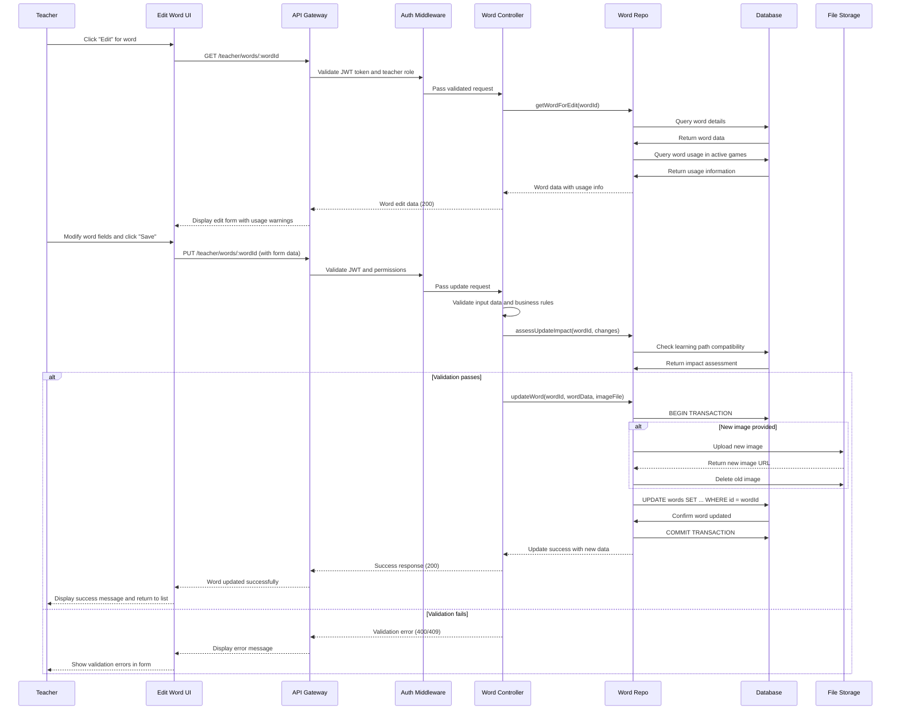
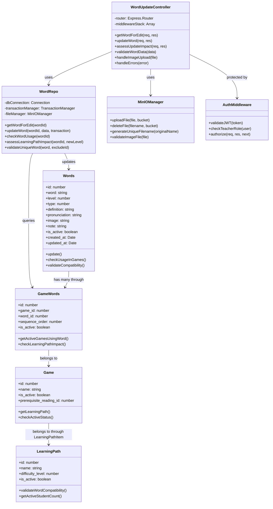

# UC_W02: Update Word

## Use Case Details

### 1. USE CASE DETAILS

**Primary Actors**
Teacher

**Secondary Actors**
None

**Trigger**
The Teacher clicks the "Edit" button next to a specific word in the Word Management list or while reviewing words assigned to games.

**Description**
As a Teacher, I want to update vocabulary word details including text, level, type, definition, pronunciation, and image, so that I can maintain accurate and up-to-date educational content while ensuring words used in active games remain functionally consistent for ongoing student learning.

**Preconditions**
- The user must be authenticated with a Teacher account and logged into the system
- The user must have access to word management functionality
- The word to be updated must exist in the system database
- The word must be accessible for editing (not locked by system constraints)

**Postconditions**
- Word details are updated in the database with new information
- Word relationships with games are preserved and validated for consistency
- Image files are properly managed in MinIO storage system
- System displays success confirmation (MSG_1) and returns to word list
- Activity log is recorded for audit purposes

### 2. NORMAL SEQUENCE/FLOW

1. **The Teacher navigates to Word Management and clicks "Edit" for a specific word.**
2. **The system loads the word edit form with existing data pre-populated:**
   - Retrieves current word information from database
   - Checks if word is currently used in any active games
   - Pre-fills form fields: word text, level, type, definition, pronunciation, note
   - Displays current image if available with option to change
3. **The system displays usage information and editing constraints:**
   - Shows list of games currently using this word (if any)
   - Indicates if word is used in active learning paths
   - Displays warning for fields that may impact active games
4. **The Teacher modifies word details in the form:**
   - Updates word text, level, type, definition, pronunciation, or note fields
   - Optionally uploads a new image file to replace existing image
   - Reviews impact warnings for changes that affect active games
5. **The Teacher clicks "Save Changes" to submit the form.**
6. **The system validates all input data and business constraints:**
   - Validates word text: not empty, ≤255 characters, unique (excluding current word)
   - Validates level: selected from 1-5 range
   - Validates type: selected from valid options (0=noun, 1=verb, 2=adjective)
   - Validates definition: ≤1000 characters if provided
   - Validates image: proper format, ≤5MB size if uploaded
   - Checks usage constraints for words in active games
7. **If validation passes, the system performs impact assessment:**
   - Identifies games using this word that are in active learning paths
   - Determines if level changes affect learning path compatibility
   - Prepares warnings for significant changes that may affect students
8. **The system starts a database transaction and executes updates:**
   - Uploads new image to MinIO storage if provided
   - Updates word record with new information
   - Removes old image from MinIO if replacement was successful
   - Validates GameWord relationship integrity
   - Commits transaction if all operations succeed
9. **The system displays success message (MSG_1) and returns to word list.**
10. **The system refreshes the word management interface with updated information.**

### 3. ALTERNATIVE SEQUENCE/FLOW

**Alternative 1 - Cancel Edit Operation:**
- **Điều kiện kích hoạt:** Teacher clicks "Cancel" button or navigates away from edit form
- **Các bước thực hiện:** 
  - System displays confirmation dialog if changes were made
  - Teacher confirms cancellation
  - System discards all unsaved changes without updating database
- **Kết quả:** System returns to word list without making any changes

**Alternative 2 - Word Used in Active Games:**
- **Điều kiện kích hoạt:** Word is currently assigned to games in active learning paths
- **Các bước thực hiện:** 
  - System displays impact warning showing affected games and learning paths
  - Teacher acknowledges the potential impact on student learning
  - System allows update with additional validation for learning path compatibility
- **Kết quả:** Word is updated but system tracks impact for educational continuity

**Alternative 3 - Level Change Impact:**
- **Điều kiện kích hoạt:** Teacher changes word difficulty level that affects learning path compatibility
- **Các bước thực hiện:** 
  - System analyzes learning paths using games that contain this word
  - Displays warning about difficulty level compatibility (MSG_12)
  - Teacher confirms understanding of impact on learning path consistency
- **Kết quả:** Update proceeds with notification to learning path administrators

### 4. EXCEPTION SEQUENCE/FLOW

**Steps 6-7: Validation Errors (After Save Click):**
- **Word text empty:** Display (MSG_5) "Word text cannot be empty"
- **Word text too long:** Display (MSG_6) "Word text cannot exceed 255 characters"
- **Word text duplicate:** Display (MSG_7) "A word with this text already exists"
- **Definition too long:** Display (MSG_8) "Definition cannot exceed 1000 characters"
- **Level not selected:** Display (MSG_9) "Word level must be selected (1-5)"
- **Type not selected:** Display (MSG_10) "Word type must be selected"

**Steps 7-8: File Upload Errors:**
- **Image file invalid:** Display (MSG_11) "Invalid image file format. Use JPG, PNG, GIF, or WebP"
- **Image file too large:** Display (MSG_13) "Image file size cannot exceed 5MB"
- **MinIO upload failed:** Display (MSG_14) "Image upload failed. Please try again"

**Steps 8-9: Business Logic Errors:**
- **Word usage constraint:** Display (MSG_15) "Cannot modify word level - would break learning path compatibility"
- **Active game constraint:** Display (MSG_16) "Cannot make significant changes - word is used in active student sessions"

**Steps 8-10: System-level Errors:**
- **Database transaction failure:** Display (MSG_21) "Update failed due to system error. Please try again"
- **Network connection failure:** Display (MSG_22) "Connection error. Please check your internet connection"
- **Transaction rollback:** Display (MSG_23) "Word update failed and changes were undone"

## Mockup Design

### 5. MOCKUP DESIGN

```
┌─────────────────────────────────────────────────────────────────────────────────────┐
│                                 Edit Word: "cat"                                    │
├─────────────────────────────────────────────────────────────────────────────────────┤
│                                                                                     │
│  ⚠️ Usage Info: This word is used in 3 active games across 2 learning paths        │
│  📊 Games: "Animal Matching", "Pet Quiz", "Basic Vocabulary Test"                  │
│                                                                                     │
│  Word Text *                                                                        │
│  ┌─────────────────────────────────────────────────────────────────────────────┐   │
│  │ cat                                                                         │   │
│  └─────────────────────────────────────────────────────────────────────────────┘   │
│                                                                                     │
│  Word Level *                         Word Type *                                   │
│  ┌─────────────────────────┐         ┌─────────────────────────────────────────┐   │
│  │ Level 1 (Beginner) ▼   │         │ Noun ▼                                 │   │
│  └─────────────────────────┘         └─────────────────────────────────────────┘   │
│                                                                                     │
│  ⚠️ Level Change Warning: Changing from Level 1 to Level 3 may affect             │
│      learning path compatibility in "Basic English Path" (Max Level: 2)            │
│                                                                                     │
│  Definition                                                                         │
│  ┌─────────────────────────────────────────────────────────────────────────────┐   │
│  │ A small furry animal that is often kept as a pet                           │   │
│  │                                                                             │   │
│  └─────────────────────────────────────────────────────────────────────────────┘   │
│                                                                                     │
│  Pronunciation                                                                      │
│  ┌─────────────────────────────────────────────────────────────────────────────┐   │
│  │ /kæt/                                                                       │   │
│  └─────────────────────────────────────────────────────────────────────────────┘   │
│                                                                                     │
│  Image                                                                              │
│  ┌─────────────────────────────────────────────────────────────────────────────┐   │
│  │ Current: [🐱 cat.jpg] [View] [Remove]                                      │   │
│  │ Upload New: [Choose File] No file chosen                                    │   │
│  │ 📝 Supported: JPG, PNG, GIF, WebP (max 5MB)                               │   │
│  └─────────────────────────────────────────────────────────────────────────────┘   │
│                                                                                     │
│  Notes                                                                              │
│  ┌─────────────────────────────────────────────────────────────────────────────┐   │
│  │ Common household pet, used in beginner vocabulary lessons                   │   │
│  │                                                                             │   │
│  └─────────────────────────────────────────────────────────────────────────────┘   │
│                                                                                     │
│  💡 Impact Assessment:                                                              │
│  • Level change will require review of learning path assignments                   │
│  • 156 students currently studying games using this word                           │
│                                                                                     │
├─────────────────────────────────────────────────────────────────────────────────────┤
│                            [Cancel]  [Reset Changes]  [Save Changes]               │
└─────────────────────────────────────────────────────────────────────────────────────┘
```

### 6. UI ELEMENTS DESCRIPTION

**Usage Information Panel:**
- **Active Usage Indicator:** Shows games and learning paths currently using this word
- **Student Impact Counter:** Displays number of students potentially affected by changes
- **Warning Badges:** Color-coded alerts for high-impact changes

**Form Fields:**
- **Word Text Field:** Required text input with real-time uniqueness validation
- **Level Dropdown:** Required selection (1-5) with learning path compatibility checking
- **Type Dropdown:** Required selection (Noun/Verb/Adjective) with current selection highlighted
- **Definition Textarea:** Optional multi-line text with character counter (1000 max)
- **Pronunciation Field:** Optional IPA phonetic notation input
- **Notes Textarea:** Optional additional information field

**Image Management:**
- **Current Image Display:** Shows existing image with view and remove options
- **Upload Control:** File picker for new image with format and size validation
- **Format Requirements:** Clear indication of supported formats and size limits

**Impact Assessment:**
- **Compatibility Warnings:** Alerts for changes affecting learning path difficulty consistency
- **Student Impact Info:** Information about ongoing student sessions that may be affected
- **Change Summary:** Overview of modifications and their potential educational impact

## Error Messages & Validation Messages

### 7. ERROR MESSAGES & VALIDATION MESSAGES

#### Messages
- **MSG_1:** "Word updated successfully"
- **MSG_5:** "Word text cannot be empty"
- **MSG_6:** "Word text cannot exceed 255 characters"
- **MSG_7:** "A word with this text already exists"
- **MSG_8:** "Definition cannot exceed 1000 characters"
- **MSG_9:** "Word level must be selected (1-5)"
- **MSG_10:** "Word type must be selected"
- **MSG_11:** "Invalid image file format. Use JPG, PNG, GIF, or WebP"
- **MSG_12:** "Warning: Level change may affect learning path compatibility"
- **MSG_13:** "Image file size cannot exceed 5MB"
- **MSG_14:** "Image upload failed. Please try again"
- **MSG_15:** "Cannot modify word level - would break learning path compatibility"
- **MSG_16:** "Cannot make significant changes - word is used in active student sessions"
- **MSG_21:** "Update failed due to system error. Please try again"
- **MSG_22:** "Connection error. Please check your internet connection"
- **MSG_23:** "Word update failed and changes were undone"

#### When These Messages Occur

**MSG_1** - Hiển thị khi:
- Word update transaction commits successfully
- After step 9 in Normal Sequence/Flow
- Appears as success toast notification

**MSG_5, MSG_6, MSG_7** - Hiển thị khi:
- Word text validation fails during save attempt (step 6)

**MSG_8** - Hiển thị khi:
- Definition field exceeds 1000 character limit (step 6)

**MSG_9, MSG_10** - Hiển thị khi:
- Required level or type fields are not selected (step 6)

**MSG_11, MSG_13, MSG_14** - Hiển thị khi:
- Image file validation or upload fails (step 7-8)

**MSG_12** - Hiển thị khi:
- Level change affects learning path compatibility (step 7, Alternative 3)

**MSG_15, MSG_16** - Hiển thị khi:
- Business logic prevents update due to active usage (step 7-8)

**MSG_21, MSG_22, MSG_23** - Hiển thị khi:
- System-level errors occur during transaction (step 8-10)

### 8. BUSINESS RULES APPLIED TO UC_W02

| ID | Business Rule | Description | Implementation |
|----|---------------|-------------|----------------|
| **BR_1** | Transaction required for UPDATE operations | All word update operations must use database transaction | Sequelize transaction wrapper with rollback |
| **BR_2** | Teacher authorization required | Only authenticated teachers can update words | JWT + Role middleware validation |
| **BR_3** | Input validation at controller | All word data must be validated at controller level | Express-validator middleware |
| **BR_4** | Unique word text constraint | Word text must remain unique after update (excluding current) | Database unique constraint + validation |
| **BR_5** | Usage impact assessment | Check active game usage before allowing significant changes | Query GameWords with active games |
| **BR_6** | Learning path compatibility | Level changes must maintain learning path difficulty consistency | Validate against learning path difficulty levels |
| **BR_7** | File upload validation | Images must meet format and size requirements | MinIO upload with validation |
| **BR_8** | Atomic file operations | Image upload and database update must be atomic | Transaction includes file operations |

## Technical Implementation Notes

### 9. TECHNICAL IMPLEMENTATION NOTES

#### Required API Endpoints
- `GET /teacher/words/:wordId` - Get word details for editing with usage information
- `PUT /teacher/words/:wordId` - Update word with validation and impact assessment
- `GET /teacher/words/:wordId/usage` - Get detailed usage information for impact assessment

#### API Request Contract
```javascript
PUT /teacher/words/:wordId
Content-Type: multipart/form-data
Authorization: Bearer <JWT_TOKEN>

// Form data fields
// word: string (required, max 255 chars)
// level: number (required, 1-5)
// type: number (required, 0-2: Noun/Verb/Adjective)
// definition: string (optional, max 1000 chars)
// pronunciation: string (optional, max 100 chars)
// note: string (optional, max 1000 chars)
// image: file (optional, JPG/PNG/GIF/WebP, max 5MB)
// remove_image: boolean (optional, removes existing image)
// force_update: boolean (optional, bypass some warnings)
```

#### API Response Contract
```javascript
// Success Response (200)
{
  "statusCode": 200,
  "message": "Word updated successfully",
  "data": {
    "id": 123,
    "word": "cat",
    "level": 2,
    "type": 0,
    "definition": "A small furry animal that is often kept as a pet",
    "pronunciation": "/kæt/",
    "image": "https://minio-url/words/cat_updated_20250918.jpg",
    "note": "Updated for better learning consistency",
    "is_active": 1,
    "updated_at": "2025-09-18T10:30:00Z",
    "usage_info": {
      "active_games": 3,
      "learning_paths": 2,
      "affected_students": 156
    }
  }
}

// Validation Error Response (400)
{
  "statusCode": 400,
  "message": "Word text already exists",
  "data": {
    "field": "word",
    "conflicting_word_id": 456
  }
}

// Business Logic Error Response (409)
{
  "statusCode": 409,
  "message": "Cannot modify word level - would break learning path compatibility",
  "data": {
    "affected_learning_paths": [
      {
        "id": 5,
        "name": "Basic English Reading Path",
        "max_difficulty": 2,
        "current_word_level": 1,
        "requested_level": 3
      }
    ]
  }
}
```

#### Database Operations Required
- **Transaction pattern:** Use Sequelize transaction for atomic operations
- **Models involved:** Words, GameWords, Game, LearningPath, LearningPathItem
- **Usage analysis:** Query active games and learning paths using this word
- **Impact assessment:** Calculate learning path compatibility and student impact
- **File management:** MinIO upload/delete operations within transaction scope
- **Validation logic:** Uniqueness check excluding current word, usage constraint checking

#### Security & Performance Considerations
- **Authentication:** JWT token validation with teacher role check
- **Input validation:** Sanitize all text inputs, validate file uploads, check data types
- **Usage tracking:** Efficient queries to determine word usage without performance impact
- **File security:** Validate image files, prevent malicious uploads, manage storage cleanup
- **Transaction safety:** Proper rollback on any operation failure including file operations

## Diagram Components Overview

### 10. DIAGRAM COMPONENTS OVERVIEW

#### Sequence Diagram



#### Class Diagram



## Notes

### 11. NOTES

- **Dependencies:** This use case depends on:
  - Word usage tracking through GameWords for impact assessment
  - Learning path difficulty validation for educational consistency
  - MinIO file storage for image management with transaction safety
  - Session management for preserving edit state during validation errors
- **Context integration:** 
  - Word updates consider active game usage to prevent educational disruption
  - Learning path compatibility checking ensures difficulty level consistency
  - Image management integrates with MinIO storage for efficient file handling
  - Usage impact assessment helps teachers understand the scope of changes
- **Future enhancements:** 
  - Batch word editing for efficient management of large vocabularies
  - Version history tracking for word changes with rollback capability
  - AI-powered suggestions for improving word definitions and difficulty levels
  - Automated learning path compatibility analysis with recommendation engine
- **Known limitations:** 
  - Cannot update words that would break critical learning path sequences
  - Image replacement requires manual confirmation to prevent accidental loss
  - Level changes affecting active student sessions require additional approval
  - Bulk operations not supported - must edit words individually
- **Integration requirements:** 
  - Tight integration with Game Assignment (UC_G06) for usage validation
  - Learning Path Management for difficulty compatibility assessment
  - File Upload system integration for image handling and validation
- **Special considerations:** 
  - Transaction safety includes file operations to prevent orphaned images
  - Usage impact assessment prevents breaking active student learning sessions
  - Level change validation maintains learning path educational progression
  - Real-time validation provides immediate feedback during form completion
  - Educational continuity prioritized over administrative convenience  