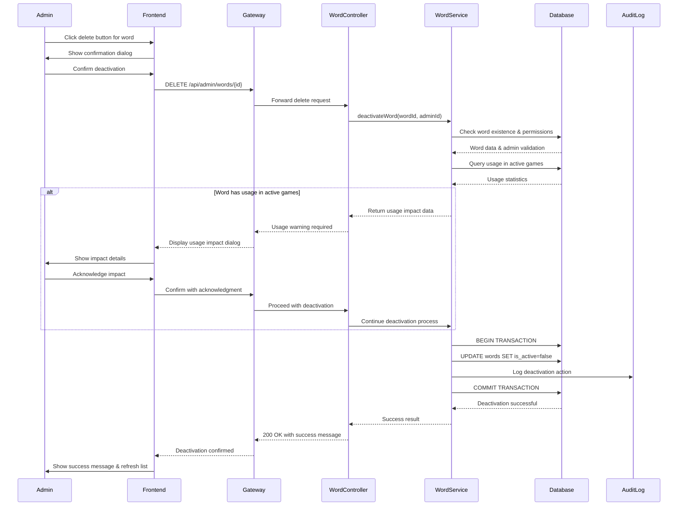
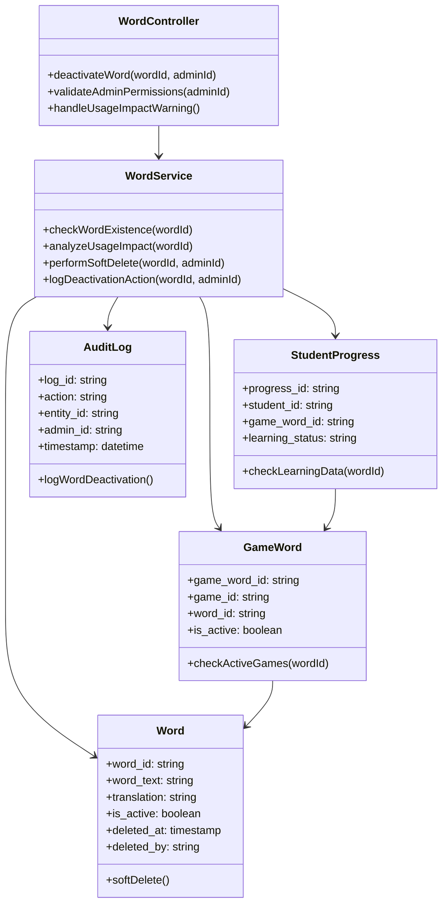

# UC_W03 Delete Word

## 1. USE CASE DETAILS

### Use Case Name
Delete Word

### Primary Actor
- Admin (System Administrator)

### Secondary Actors
- System Database
- File Storage (MinIO)
- Notification System

### Trigger
Admin clicks the "Delete" button for a specific word in the Word Management section.

### Brief Description
As an Admin, I want to deactivate a word using soft delete, so that I can remove unused or incorrect vocabulary from active use while preserving learning progress data and maintaining referential integrity.

### Preconditions
- User must be authenticated as Admin
- User must have word management permissions

### Postconditions
- Word is marked as inactive (is_active = false) in database
- All associated files remain in storage for audit purposes
- GameWord relationships are preserved but word becomes unavailable for new assignments
- Student learning progress data is maintained
- Activity log records the deactivation action
- Success/error message is displayed to Admin

## 2. NORMAL SEQUENCE/FLOW

1. Admin navigates to Word Management section
2. System displays paginated list of active words with search and filter options
3. Admin locates target word using search/filter or pagination
4. Admin clicks "Delete" button for the specific word
5. System displays confirmation dialog: "Are you sure you want to deactivate this word?"
6. Admin confirms by clicking "Confirm Deactivate"
7. System validates word existence and Admin permissions
8. System checks usage in active games:
   - Query GameWords table for active game associations
   - Check StudentProgress for learning data involving this word
9. If word is used in active games:
   - System displays warning dialog (MSG_W04_001): "This word is used in X active games. Students' learning progress will be preserved but the word will become unavailable for new assignments."
10. System performs soft delete operation:
    - Set word.is_active = false
    - Set word.deleted_at = current timestamp
    - Set word.deleted_by = admin_id
11. System updates related data:
    - GameWord relationships remain but word becomes inactive
    - Student progress data is preserved
12. System logs the deactivation action
13. System displays success message (MSG_W04_002)
14. System refreshes word list excluding deactivated words

## 3. ALTERNATIVE/EXCEPTION FLOWS

### Exception Flow E1: Word Not Found
- Step 7: Word no longer exists in database
- System displays error (MSG_W04_003): "Word not found"
- System refreshes the word list

### Exception Flow E2: Permission Denied
- Step 7: Admin lacks sufficient permissions
- System displays error (MSG_W04_004): "Insufficient permissions to deactivate words."
- System returns to word management


## 4. MOCKUP DESIGN

### Word Management Page Layout
```
[Header: Word Management]
[Search: ___________] [Filter: Difficulty ▼] [Add Word +]

[Data Table]
| Word Text | Translation | Difficulty | Audio | Image | Created | Actions |
|-----------|-------------|-----------|--------|--------|---------|---------|
| Apple     | Táo        | Easy      | 🔊     | 🖼️     | 2024... | ✏️ 🗑️   |
| Banana    | Chuối      | Easy      | 🔊     | 🖼️     | 2024... | ✏️ 🗑️   |

[Pagination: ← 1 2 3 ... 10 →]
```

### Confirmation Dialog
```
┌─ Confirm Deactivation ────────────────────┐
│ Are you sure you want to deactivate       │
│ this word?                                 │
│                                            │
│ Word: "Apple"                              │
│ This action will make the word unavailable │
│ for new game assignments.                  │
│                                            │
│ [Cancel] [Confirm Deactivate]              │
└────────────────────────────────────────────┘
```

### Usage Impact Warning Dialog
```
┌─ Usage Impact Warning ────────────────────┐
│ This word is currently used in:            │
│ • 3 active games                           │
│ • 45 students have learning progress       │
│                                            │
│ Deactivating will:                         │
│ ✓ Preserve all student progress            │
│ ✓ Keep existing game associations          │
│ ✗ Prevent new game assignments             │
│                                            │
│ [View Details] [Cancel] [Acknowledge]      │
└────────────────────────────────────────────┘
```

## 5. UI ELEMENTS DESCRIPTION

### Word Management Interface
- **Search Box**: Real-time search by word text or translation
- **Difficulty Filter**: Dropdown to filter by difficulty level (Easy, Medium, Hard)
- **Data Table**: Sortable columns with word information
- **Delete Button**: Red trash icon with hover tooltip "Deactivate Word"
- **Pagination Controls**: Navigate through large word collections

### Confirmation Dialog Elements
- **Modal Overlay**: Semi-transparent background with centered dialog
- **Word Information**: Display word text and key details
- **Impact Summary**: Brief description of deactivation effects
- **Action Buttons**: Cancel (secondary) and Confirm (primary destructive)

### Usage Impact Dialog Elements
- **Statistics Panel**: Show active games count and affected students
- **Impact Checklist**: Visual representation of what will/won't happen
- **Detail Link**: Option to view comprehensive usage report
- **Acknowledgment Button**: Require explicit understanding of consequences

## 6. ERROR MESSAGES & VALIDATION MESSAGES

| Message ID | Type | Message Text | Trigger Condition |
|------------|------|--------------|-------------------|
| MSG_W04_001 | Warning | "This word is used in {count} active games. Students' learning progress will be preserved but the word will become unavailable for new assignments. Do you want to continue?" | Word is associated with active games |
| MSG_W04_002 | Success | "Word '{word_text}' has been successfully deactivated." | Successful soft delete operation |
| MSG_W04_003 | Error | "Word not found. It may have been already deleted by another administrator." | Word doesn't exist when attempting deletion |
| MSG_W04_004 | Error | "Insufficient permissions to deactivate words. Please contact your administrator." | User lacks required permissions |
| MSG_W04_005 | Error | "Failed to deactivate word due to system error. Please try again later." | Database or system operation failure |
| MSG_W04_006 | Error | "Word has been modified by another user. Please refresh the page and try again." | Concurrent modification detected |
| MSG_W04_007 | Info | "Deactivated words are hidden from this list. Use 'Show Inactive' filter to view them." | When word list refreshes after deletion |

## 7. BUSINESS RULES APPLIED

| Rule ID | Business Rule | Implementation |
|---------|---------------|----------------|
| BR_W04_001 | Words must use soft delete (is_active flag) instead of physical deletion | Set is_active = false, deleted_at = timestamp |
| BR_W04_002 | Student learning progress must be preserved when deactivating words | Maintain all StudentProgress records intact |
| BR_W04_003 | GameWord relationships must be preserved for historical integrity | Keep GameWord records, word becomes inactive |
| BR_W04_004 | Only Admins can deactivate words | Verify admin role and word management permissions |
| BR_W04_005 | Deactivated words cannot be assigned to new games | Filter out inactive words in game assignment interface |
| BR_W04_006 | All deactivation actions must be logged for audit trail | Record admin_id, timestamp, reason in audit log |
| BR_W04_007 | Usage impact must be displayed before confirmation | Check and display active game associations |
| BR_W04_008 | Concurrent modifications must be detected and prevented | Use optimistic locking or version control |

## 8. TECHNICAL IMPLEMENTATION NOTES

### Database Operations
```sql
-- Soft delete implementation
UPDATE words 
SET is_active = false, 
    deleted_at = NOW(), 
    deleted_by = :admin_id,
    updated_at = NOW()
WHERE word_id = :word_id 
  AND is_active = true;

-- Check usage in active games
SELECT COUNT(DISTINCT gw.game_id) as active_games_count,
       COUNT(DISTINCT sp.student_id) as affected_students_count
FROM game_words gw
JOIN games g ON gw.game_id = g.game_id
LEFT JOIN student_progress sp ON gw.game_word_id = sp.game_word_id
WHERE gw.word_id = :word_id 
  AND g.is_active = true;
```

### API Endpoint Structure
```
DELETE /api/admin/words/{word_id}
Authorization: Bearer {admin_token}

Response Codes:
- 200: Successfully deactivated
- 403: Insufficient permissions  
- 404: Word not found
- 409: Concurrent modification conflict
- 500: Server error
```

### Service Layer Logic
```typescript
async deactivateWord(wordId: string, adminId: string): Promise<DeactivationResult> {
  // 1. Validate admin permissions
  // 2. Check word existence and current status
  // 3. Analyze usage impact in active games
  // 4. Perform soft delete with transaction
  // 5. Log deactivation action
  // 6. Return result with impact summary
}
```

### File Storage Handling
- Word audio and image files remain in MinIO storage
- Files are marked with metadata indicating word deactivation
- Cleanup processes can handle orphaned files separately
- Audit trail maintains file path references

## 9. DIAGRAM COMPONENTS OVERVIEW

### Sequence Diagram: Word Deactivation Flow


### Class Diagram: Word Deactivation Components


## 10. NOTES

### Dependencies
- **UC_G06_Assign_Words_To_Game**: Must filter out deactivated words from assignment interface
- **UC_W02_Update_Word**: Cannot update deactivated words without reactivation
- **Student Game Interface**: Must handle gracefully when words become inactive during gameplay

### Integration Requirements
- **Audit System**: All deactivation actions must be logged with admin identification
- **Permission Management**: Integration with role-based access control system
- **Game Assignment System**: Must respect word active status in real-time
- **Student Progress Tracking**: Must preserve all historical learning data

### Special Considerations
- **Educational Continuity**: Students mid-game when word is deactivated should complete current game session
- **Data Integrity**: Soft delete ensures referential integrity while removing content from active use
- **Recovery Process**: Provide mechanism for reactivating words if needed (separate UC)
- **Batch Operations**: Consider future enhancement for bulk deactivation with comprehensive impact analysis

### Performance Considerations
- **Usage Query Optimization**: Index on game_words(word_id, game_id) for efficient usage checking
- **Soft Delete Filtering**: Ensure all word queries include is_active = true condition
- **Audit Log Partitioning**: Consider partitioning audit logs by date for performance

### Security Considerations  
- **Admin Authentication**: Verify admin session validity before allowing deactivation
- **Permission Granularity**: Distinguish between word creation and deactivation permissions
- **Audit Trail**: Maintain immutable log of all deactivation actions for compliance
- **Concurrent Access**: Handle simultaneous admin actions on same word gracefully

### Future Enhancements
- **Bulk Deactivation**: Allow selecting and deactivating multiple words simultaneously
- **Reactivation Workflow**: Provide interface for reactivating previously deactivated words
- **Impact Analytics**: Detailed reports showing long-term effects of word deactivation on learning outcomes
- **Automated Cleanup**: Scheduled process to handle orphaned files from deactivated words  
