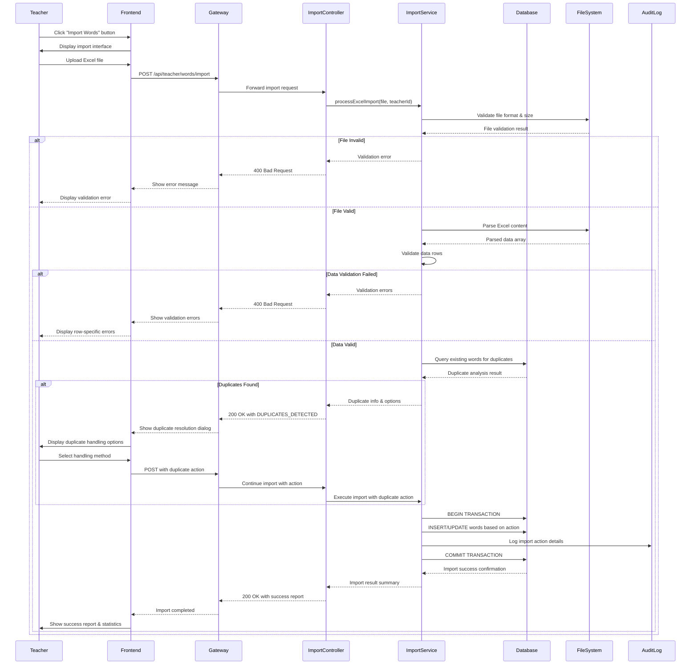
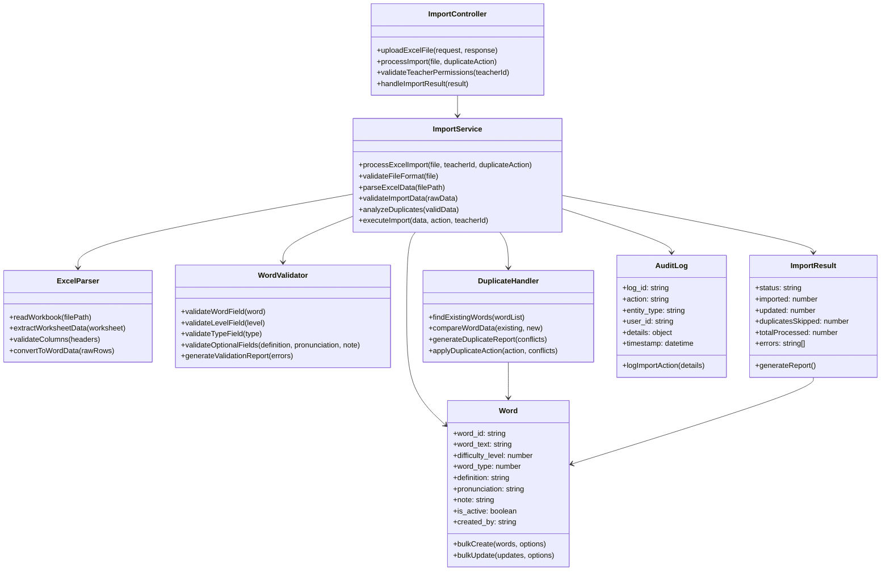
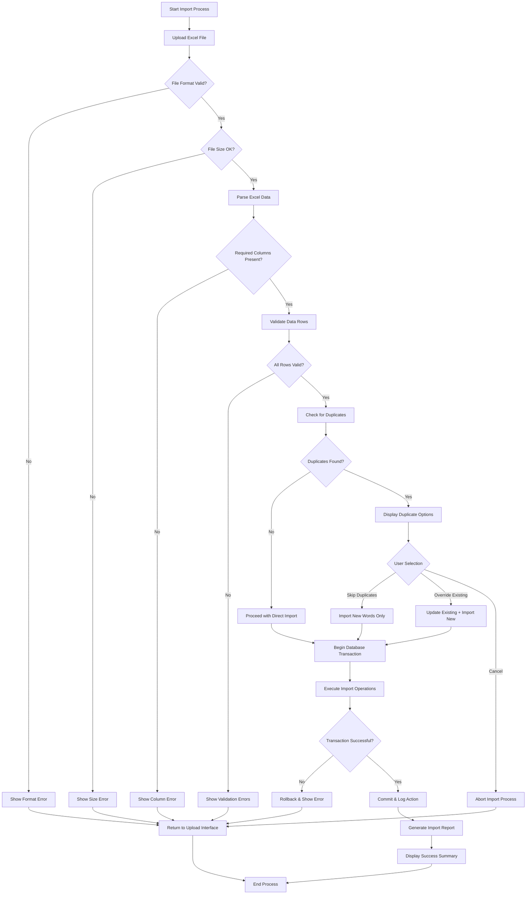

# UC_W04 Import Words from Excel

## 1. USE CASE DETAILS

### Use Case Name
Import Words from Excel

### Primary Actor
- Teacher (Content Creator)

### Secondary Actors
- File System (MinIO Storage)
- Database System
- Excel Parser Service
- Notification System
- Audit Log System

### Trigger
Teacher clicks "Import Words" button in Word Management section and uploads an Excel file containing vocabulary data.

### Brief Description
As a Teacher, I want to import multiple words from an Excel file with validation and duplicate handling, so that I can efficiently add vocabulary content to the system while maintaining data integrity and avoiding conflicts.

### Preconditions
- User must be authenticated as Teacher
- User must have word management permissions
- Excel file must be in valid format (.xlsx, .xls)
- System must be accessible and operational
- File size must not exceed 10MB limit

### Postconditions
- Valid words are successfully imported to database
- Import report shows success/failed/duplicate statistics
- All import activities are logged for audit trail
- Duplicate conflicts are resolved according to teacher preferences
- Invalid data is reported with specific error messages
- System returns to word management with updated word list

## 2. NORMAL SEQUENCE/FLOW

1. Teacher navigates to Word Management section
2. Teacher clicks "Import Words" button
3. System displays import interface with file upload area and template download option
4. Teacher downloads Excel template (optional) to understand required format
5. Teacher selects Excel file using file picker or drag-and-drop
6. Teacher clicks "Upload & Process" button
7. **File Validation Phase:**
   - System validates file format (.xlsx, .xls only)
   - System checks file size (maximum 10MB)
   - System verifies file is not corrupted
8. **Data Parsing Phase:**
   - System parses Excel file and extracts data
   - System validates required columns: word, level, type
   - System identifies optional columns: definition, pronunciation, note
9. **Data Validation Phase:**
   - System validates each row for completeness and format
   - System checks word field is not empty
   - System validates level is integer 1-5
   - System validates type is integer 0,1,2 (noun/verb/adjective)
   - System enforces maximum 1000 words per file limit
10. **Duplicate Detection Phase:**
    - System queries database for existing words
    - System identifies conflicts based on exact word matching
    - System categorizes data: new words, duplicates, invalid rows
11. **Conflict Resolution (if duplicates found):**
    - System displays preview with duplicate words highlighted
    - System shows import statistics and impact summary
    - Teacher selects handling method: Skip duplicates, Override existing, or Cancel import
    - Teacher confirms selection and acknowledges impact
12. **Import Execution Phase:**
    - System begins database transaction
    - System inserts new words according to selected duplicate handling
    - System updates existing words if override option selected
    - System validates all changes before commit
13. **Post-Import Phase:**
    - System commits transaction and displays import report
    - System shows detailed statistics: successful imports, duplicates handled, errors
    - System provides download link for error log (if any errors occurred)
    - System refreshes word management list with newly imported words

## 3. ALTERNATIVE/EXCEPTION FLOWS

### Alternative Flow A: Cancel Import Process
- Step 6: Teacher clicks "Cancel" before uploading file
- System returns to Word Management without any changes

### Alternative Flow B: Download Template First
- Step 4: Teacher clicks "Download Template" to get Excel format guide
- System provides Excel template with sample data and column headers
- Teacher can use template as reference for formatting their data

### Alternative Flow C: Skip All Duplicates
- Step 11: Teacher selects "Skip duplicates" for conflict resolution
- System imports only new words, preserving existing data unchanged
- System shows final report with skipped duplicates count

### Alternative Flow D: Override All Duplicates
- Step 11: Teacher selects "Override existing" for conflict resolution
- System updates all existing words with new data from Excel
- System shows final report with updated words count

### Exception Flow E1: Invalid File Format
- Step 7: File is not Excel format or is corrupted
- System displays error (MSG_W05_001): "Invalid file format. Please upload .xlsx or .xls file"
- System returns to upload interface

### Exception Flow E2: File Size Exceeded
- Step 7: File size exceeds 10MB limit
- System displays error (MSG_W05_002): "File size exceeds 10MB limit. Please split into smaller files"
- System suggests optimization strategies

### Exception Flow E3: Missing Required Columns
- Step 8: Excel file lacks required columns (word, level, type)
- System displays error (MSG_W05_003): "Missing required columns: {column_list}. Please check template"
- System provides template download link

### Exception Flow E4: Too Many Records
- Step 9: Excel contains more than 1000 rows
- System displays error (MSG_W05_004): "Maximum 1000 words per file. Current file has {count} words"
- System suggests splitting file into multiple imports

### Exception Flow E5: All Words Invalid
- Step 9: All rows fail validation (empty words, invalid levels/types)
- System displays error (MSG_W05_005): "No valid words found. Please check data format"
- System provides detailed validation error report

### Exception Flow E6: All Words Are Duplicates
- Step 10: All words already exist in database
- System displays warning (MSG_W05_006): "All {count} words already exist in database"
- Teacher can choose to override all or cancel import

### Exception Flow E7: Database Transaction Failed
- Step 12: Database operation fails during import
- System performs automatic rollback of all changes
- System displays error (MSG_W05_007): "Import failed due to system error. Please try again"
- System logs error details for administrator review

### Exception Flow E8: Memory Insufficient
- Step 8: File too large causing memory issues
- System displays error (MSG_W05_008): "File too large to process. Please reduce file size or split into smaller files"
- System provides file optimization recommendations

### Exception Flow E9: Concurrent Import Conflict
- Step 12: Another teacher is performing import operation simultaneously
- System displays warning (MSG_W05_009): "Another import is in progress. Please wait and try again"
- System queues the import or suggests retry timing

## 4. MOCKUP DESIGN

### Import Words Main Interface
```
┌─ Word Import ──────────────────────────────────────────┐
│ [← Back to Word Management]                            │
│                                                        │
│ 📤 IMPORT WORDS FROM EXCEL                             │
│                                                        │
│ Step 1: Choose File                                    │
│ ┌────────────────────────────────────────────────────┐ │
│ │ 📁 Drag & drop Excel file here                     │ │
│ │    or                                              │ │  
│ │ [Choose File] No file selected                     │ │
│ │                                                    │ │
│ │ Supported: .xlsx, .xls (Max 10MB)                 │ │
│ └────────────────────────────────────────────────────┘ │
│                                                        │
│ 📋 Import Requirements:                                │
│ • Required columns: word, level, type                  │
│ • Optional columns: definition, pronunciation, note    │
│ • Level: 1-5 (difficulty), Type: 0-2 (word type)      │
│ • Maximum 1000 words per file                          │
│                                                        │
│ [📥 Download Template] [Upload & Process] [Cancel]     │
└────────────────────────────────────────────────────────┘
```

### File Processing Progress Interface
```
┌─ Processing Import ────────────────────────────────────┐
│                                                        │
│ 📊 PROCESSING: vocabulary_list.xlsx                    │
│                                                        │
│ ████████████████████░░░░  80% Complete                │
│                                                        │
│ Current Step: Validating data rows...                  │
│                                                        │
│ 📈 Progress Summary:                                   │
│ • Total rows processed: 800/1000                       │
│ • Valid words found: 750                               │
│ • Invalid rows: 25                                     │
│ • Duplicates detected: 25                              │
│                                                        │
│ [Cancel Process]                                       │
└────────────────────────────────────────────────────────┘
```

### Duplicate Resolution Dialog
```
┌─ Resolve Duplicates ───────────────────────────────────┐
│ ⚠️  DUPLICATE WORDS DETECTED                           │
│                                                        │
│ Found 25 duplicate words out of 1000 total words      │
│                                                        │
│ 📊 Import Analysis:                                    │
│ ✅ New words ready to import: 950                      │
│ ⚠️  Duplicate words found: 25                          │
│ ❌ Invalid rows (skipped): 25                          │
│                                                        │
│ 🔄 How should duplicates be handled?                   │
│ ○ Skip duplicates (import 950 new words only)          │
│ ○ Override existing words with new data                │  
│ ○ Cancel entire import                                 │
│                                                        │
│ 📝 Duplicate Words Preview:                            │
│ ┌──────────────────────────────────────────────────────┐ │
│ │Word    │Existing │New     │Definition│Action       │ │
│ │        │Level    │Level   │Changed   │Recommended  │ │
│ │────────├─────────┼────────┼──────────┼─────────────│ │
│ │apple   │2        │3       │Yes       │Override     │ │
│ │book    │1        │1       │No        │Skip         │ │
│ │run     │2        │2       │Yes       │Override     │ │
│ │...     │...      │...     │...       │...          │ │
│ └──────────────────────────────────────────────────────┘ │
│                                                        │
│ [View All Details] [Proceed with Selection] [Cancel]   │
└────────────────────────────────────────────────────────┘
```

### Import Results Summary
```
┌─ Import Complete ──────────────────────────────────────┐
│ ✅ IMPORT SUCCESSFUL                                    │
│                                                        │
│ File: vocabulary_list.xlsx                             │
│ Processed on: 2024-01-15 14:30:25                     │
│                                                        │
│ 📈 Final Results:                                      │
│ ✅ Successfully imported: 950 words                    │
│ ⚠️  Duplicates skipped: 25 words                       │
│ ❌ Invalid rows ignored: 25 rows                       │
│ 📊 Total processing time: 2m 15s                       │
│                                                        │
│ 📄 Detailed Reports:                                   │
│ [📥 Download Success Report] [📥 Download Error Log]   │
│                                                        │
│ [🔍 View Imported Words] [🔄 Import Another File]      │
│ [← Return to Word Management]                          │
└────────────────────────────────────────────────────────┘
```

## 5. UI ELEMENTS DESCRIPTION

### File Upload Components
- **Drag & Drop Zone**: Large rectangular area with dotted border for intuitive file dropping
- **File Picker Button**: Standard file selection button filtered to show only Excel files
- **Template Download Link**: Prominent download button for Excel template with sample data
- **File Validation Display**: Real-time feedback showing file name, size, and format validation status

### Progress Tracking Elements
- **Progress Bar**: Animated horizontal bar showing percentage completion with color coding
- **Step Indicator**: Text display showing current processing phase (validation, parsing, importing)
- **Statistics Panel**: Live counters for processed rows, valid words, duplicates, and errors
- **Time Estimation**: Dynamic display of remaining processing time and total elapsed time

### Data Preview Components
- **Validation Results Table**: Sortable table showing word data with validation status icons
- **Row Status Indicators**: Color-coded icons (✅ valid, ❌ invalid, ⚠️ duplicate)
- **Error Details Expandable Rows**: Clickable rows that expand to show specific validation errors
- **Duplicate Comparison View**: Side-by-side comparison of existing vs new word data

### Action Control Elements
- **Radio Button Groups**: Mutually exclusive options for duplicate handling strategy
- **Confirmation Checkboxes**: Explicit acknowledgment of import consequences and data changes
- **Primary Action Buttons**: Prominent "Upload & Process" and "Proceed" buttons with loading states
- **Secondary Action Buttons**: "Cancel", "Download Template", "View Details" with appropriate styling

### Notification and Feedback Components
- **Toast Messages**: Temporary notifications for success, warnings, and errors
- **Modal Dialogs**: Blocking dialogs for critical decisions and confirmations
- **Status Badges**: Compact indicators showing import status (processing, complete, failed)
- **Download Links**: Styled links for accessing import reports and error logs

## 6. ERROR MESSAGES & VALIDATION MESSAGES

| Message ID | Type | Message Text | Trigger Condition |
|------------|------|--------------|-------------------|
| MSG_W05_001 | Error | "Invalid file format. Please upload .xlsx or .xls files only." | File format is not Excel or file is corrupted |
| MSG_W05_002 | Error | "File size exceeds 10MB limit. Please reduce file size or split into smaller files." | File size larger than 10MB |
| MSG_W05_003 | Error | "Missing required columns: {column_names}. Please check template and try again." | Excel file lacks required columns (word, level, type) |
| MSG_W05_004 | Error | "Maximum 1000 words per file exceeded. Current file has {count} words. Please split into smaller files." | Excel contains more than 1000 data rows |
| MSG_W05_005 | Error | "No valid words found in file. Please check data format and required columns." | All rows fail validation |
| MSG_W05_006 | Warning | "All {count} words already exist in database. Choose 'Override' to update existing words or 'Cancel' to abort." | All words are duplicates |
| MSG_W05_007 | Error | "Import failed due to system error. Please try again later. Contact support if problem persists." | Database transaction or system failure |
| MSG_W05_008 | Error | "File too large to process in memory. Please reduce file size or contact administrator." | Memory insufficient for file processing |
| MSG_W05_009 | Warning | "Another import operation is in progress. Please wait and try again in a few minutes." | Concurrent import conflict |
| MSG_W05_010 | Error | "Row {row_number}: Word field cannot be empty." | Word field is null or empty |
| MSG_W05_011 | Error | "Row {row_number}: Level must be between 1-5, got '{value}'." | Level field contains invalid value |
| MSG_W05_012 | Error | "Row {row_number}: Type must be 0 (noun), 1 (verb), or 2 (adjective), got '{value}'." | Type field contains invalid value |
| MSG_W05_013 | Success | "Import completed successfully! {success_count} words added to database." | Successful import with no duplicates |
| MSG_W05_014 | Success | "Import completed: {success_count} new words added, {duplicate_count} duplicates skipped." | Successful import with skipped duplicates |
| MSG_W05_015 | Success | "Import completed: {updated_count} words updated, {new_count} words added." | Successful import with override option |
| MSG_W05_016 | Info | "Processing file... This may take a few minutes for large files." | File processing started |
| MSG_W05_017 | Warning | "Found {count} duplicate words. Please choose how to handle them before proceeding." | Duplicates detected requiring user decision |

## 7. BUSINESS RULES APPLIED

| Rule ID | Business Rule | Implementation |
|---------|---------------|----------------|
| BR_W05_001 | Only Excel files (.xlsx, .xls) are accepted for import | File extension validation before processing |
| BR_W05_002 | Maximum file size is 10MB to ensure system performance | File size check during upload |
| BR_W05_003 | Maximum 1000 words per import to prevent system overload | Row count validation after parsing |
| BR_W05_004 | Required columns (word, level, type) must be present | Column header validation |
| BR_W05_005 | Word field cannot be empty and must be unique | Non-null validation and duplicate detection |
| BR_W05_006 | Level must be integer between 1-5 (difficulty levels) | Range validation for level field |
| BR_W05_007 | Type must be 0 (noun), 1 (verb), or 2 (adjective) | Enumeration validation for type field |
| BR_W05_008 | Duplicate detection uses case-insensitive word matching | Lowercase comparison during duplicate check |
| BR_W05_009 | Teacher must explicitly choose duplicate handling strategy | Require user selection for conflict resolution |
| BR_W05_010 | All import operations must be atomic (all-or-nothing) | Database transaction management |
| BR_W05_011 | Import failures must trigger complete rollback | Transaction rollback on any error |
| BR_W05_012 | All import activities must be logged for audit trail | Audit log entry for every import attempt |
| BR_W05_013 | Only Teachers with word management permission can import | Role-based access control validation |
| BR_W05_014 | Optional fields (definition, pronunciation, note) can be empty | Allow null values for optional columns |
| BR_W05_015 | System must preserve data integrity during concurrent access | Locking mechanism for import operations |

## 8. TECHNICAL IMPLEMENTATION NOTES

### API Endpoint Structure
```
POST /api/teacher/words/import
Content-Type: multipart/form-data
Authorization: Bearer {teacher_token}

Request Body:
- file: Excel file (required)
- duplicateAction: "skip"|"override"|"cancel" (optional, for conflict resolution)

Response Codes:
- 200: Import successful or duplicates found (awaiting decision)
- 400: Validation error (invalid file/data)
- 403: Insufficient permissions
- 409: Concurrent import in progress
- 413: File too large
- 500: Server error
```

### Database Operations
```sql
-- Check for duplicate words (case-insensitive)
SELECT word_id, word_text, difficulty_level, word_type 
FROM words 
WHERE LOWER(word_text) IN (SELECT LOWER(word_text) FROM imported_words)
  AND is_active = 1;

-- Bulk insert new words
INSERT INTO words (word_text, difficulty_level, word_type, definition, 
                   pronunciation, note, created_by, created_at)
SELECT word_text, difficulty_level, word_type, definition, 
       pronunciation, note, :teacher_id, NOW()
FROM temp_import_data 
WHERE word_text NOT IN (SELECT word_text FROM existing_duplicates);

-- Update existing words (override mode)
UPDATE words w
SET difficulty_level = tid.difficulty_level,
    word_type = tid.word_type,
    definition = tid.definition,
    pronunciation = tid.pronunciation,
    note = tid.note,
    updated_by = :teacher_id,
    updated_at = NOW()
FROM temp_import_data tid
WHERE LOWER(w.word_text) = LOWER(tid.word_text)
  AND w.is_active = 1;
```

### Service Layer Implementation
```typescript
class WordImportService {
  async processExcelImport(
    file: Express.Multer.File, 
    teacherId: string, 
    duplicateAction?: DuplicateAction
  ): Promise<ImportResult> {
    
    // 1. File validation
    this.validateFileFormat(file);
    this.validateFileSize(file);
    
    // 2. Parse Excel content
    const workbook = XLSX.readFile(file.path);
    const worksheet = workbook.Sheets[workbook.SheetNames[0]];
    const rawData = XLSX.utils.sheet_to_json(worksheet);
    
    // 3. Validate data structure and content
    const validation = await this.validateImportData(rawData);
    if (validation.hasErrors) {
      throw new ValidationError(validation.errors);
    }
    
    // 4. Check for duplicates
    const duplicateAnalysis = await this.analyzeDuplicates(validation.validData);
    
    // 5. Handle duplicates based on action
    if (duplicateAnalysis.hasDuplicates && !duplicateAction) {
      return {
        status: 'DUPLICATES_DETECTED',
        duplicates: duplicateAnalysis.duplicates,
        newWords: duplicateAnalysis.newWords,
        requiresDecision: true
      };
    }
    
    // 6. Execute import with transaction
    const result = await this.executeImport(
      validation.validData,
      duplicateAnalysis,
      duplicateAction,
      teacherId
    );
    
    return result;
  }
  
  private async executeImport(
    validData: WordData[],
    duplicateAnalysis: DuplicateAnalysis,
    action: DuplicateAction,
    teacherId: string
  ): Promise<ImportResult> {
    
    const transaction = await this.db.transaction();
    
    try {
      let importedCount = 0;
      let updatedCount = 0;
      
      // Handle new words
      if (duplicateAnalysis.newWords.length > 0) {
        const newWords = duplicateAnalysis.newWords.map(word => ({
          ...word,
          created_by: teacherId,
          created_at: new Date()
        }));
        
        await Word.bulkCreate(newWords, { transaction });
        importedCount = newWords.length;
      }
      
      // Handle duplicates based on action
      if (action === 'override' && duplicateAnalysis.duplicates.length > 0) {
        for (const duplicate of duplicateAnalysis.duplicates) {
          await Word.update(duplicate.newData, {
            where: { word_id: duplicate.existing.word_id },
            transaction
          });
          updatedCount++;
        }
      }
      
      // Log import action
      await AuditLog.create({
        action: 'WORD_IMPORT',
        entity_type: 'WORDS',
        entity_id: null,
        user_id: teacherId,
        details: {
          imported: importedCount,
          updated: updatedCount,
          duplicates_skipped: action === 'skip' ? duplicateAnalysis.duplicates.length : 0,
          total_processed: validData.length
        }
      }, { transaction });
      
      await transaction.commit();
      
      return {
        status: 'SUCCESS',
        imported: importedCount,
        updated: updatedCount,
        duplicatesSkipped: action === 'skip' ? duplicateAnalysis.duplicates.length : 0,
        totalProcessed: validData.length
      };
      
    } catch (error) {
      await transaction.rollback();
      throw error;
    }
  }
}
```

### File Processing Logic
```typescript
interface WordData {
  word: string;
  level: number;
  type: number;
  definition?: string;
  pronunciation?: string;
  note?: string;
}

interface ValidationResult {
  validData: WordData[];
  errors: string[];
  hasErrors: boolean;
}

interface DuplicateAnalysis {
  hasDuplicates: boolean;
  duplicates: DuplicateInfo[];
  newWords: WordData[];
}

type DuplicateAction = 'skip' | 'override' | 'cancel';
```

## 9. DIAGRAM COMPONENTS OVERVIEW

### Sequence Diagram: Excel Import Process Flow


### Class Diagram: Import System Components


### Activity Diagram: Import Decision Flow


## 10. NOTES

### Dependencies
- **UC_W01_Create_Word**: Imported words must follow same validation rules as manual word creation
- **UC_G05_Assign_Words_To_Game**: New imported words must be available for game assignment
- **Permission System**: Integration with role-based access control for teacher permissions

### Integration Requirements
- **Excel Processing Library**: XLSX.js or similar for reliable Excel file parsing
- **Database Transaction Management**: Sequelize or similar ORM for atomic operations
- **File Storage System**: MinIO or filesystem for temporary file handling during processing
- **Audit System**: Comprehensive logging of all import activities for compliance tracking
- **Notification System**: Toast messages and progress indicators for user feedback

### Performance Considerations
- **Memory Management**: Process large files in streaming chunks to prevent memory overflow
- **Database Optimization**: Use bulk insert/update operations instead of individual queries
- **File Cleanup**: Automatic deletion of uploaded files after processing completion
- **Connection Pooling**: Efficient database connection management for concurrent imports
- **Indexing Strategy**: Proper database indexes on word_text column for duplicate detection

### Security Considerations
- **File Type Validation**: Strict MIME type and extension checking to prevent malicious uploads
- **Input Sanitization**: Clean and validate all Excel data before database insertion
- **Size Limits**: Enforce file size restrictions to prevent DoS attacks
- **Permission Verification**: Validate teacher permissions on every import request
- **SQL Injection Prevention**: Use parameterized queries for all database operations

### User Experience Enhancements
- **Progress Indicators**: Real-time progress bars for large file processing
- **Error Reporting**: Detailed, line-specific error messages with Excel row references
- **Template Downloads**: Standardized Excel templates with examples and formatting guides
- **Preview Functionality**: Allow users to preview parsed data before final import
- **Undo Capability**: Consider implementing import rollback for recent operations

### Future Enhancements
- **Background Processing**: Implement job queue system for large imports to improve UX
- **Import History**: Maintain detailed history of all import sessions with downloadable reports
- **Batch Operations**: Support uploading and processing multiple Excel files simultaneously
- **Data Transformation**: Auto-correction features for common formatting issues and case normalization
- **Validation Rules Engine**: Configurable validation rules for different educational contexts
- **Integration APIs**: REST endpoints for third-party system integration

### Educational Context Considerations
- **Learning Path Integration**: Ensure imported words align with existing learning path difficulty progressions
- **Curriculum Alignment**: Consider adding curriculum standard mapping for imported vocabulary
- **Language Support**: Plan for multilingual vocabulary imports with proper encoding handling
- **Assessment Readiness**: Ensure imported words are immediately usable in assessment and game contexts

### Maintenance and Monitoring
- **Error Monitoring**: Implement comprehensive error tracking and alerting for failed imports
- **Performance Metrics**: Track import success rates, processing times, and user satisfaction
- **Data Quality Assurance**: Regular audits of imported data for consistency and accuracy
- **Backup Procedures**: Ensure imported data is included in regular database backup processes

### Known Limitations
- **Excel Format Complexity**: Advanced Excel features (formulas, macros) are not supported
- **Character Encoding**: Some special characters may require UTF-8 encoding validation
- **Concurrent Processing**: Multiple simultaneous imports by same user are not supported
- **File Format Evolution**: May require updates for new Excel format versions